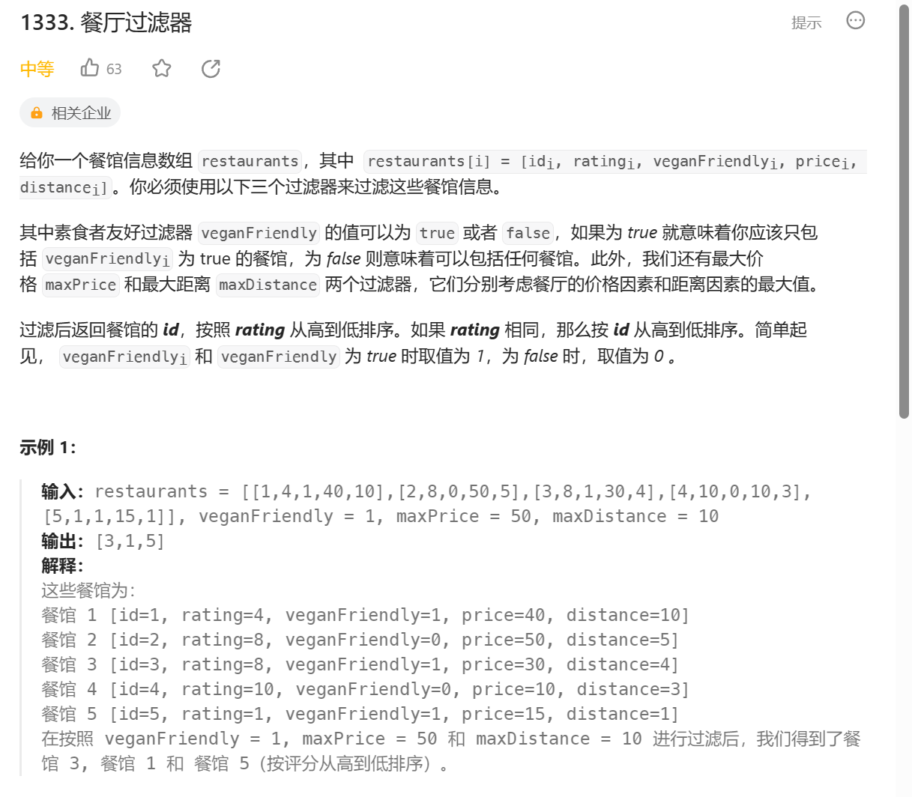

题目很简单，我们只需要一遍循环筛序一遍排序就行。


sort的基础用法：
```
#include<algorithm>
// ...
sort(begin, end);
sort(begin, end, cmp);
```
sort默认按照从小到大排序。cmp是个自己定义的函数

```
 sort(e.begin(), e.end(), [](vector<int> &v1, vector<int> &v2) -> bool {
            return v1[1] > v2[1] || (v1[1] == v2[1] && v1[0] > v2[0]);
        });
```


这是把lambda嵌入在了cmp部分，参数列表是v1，v2。

我觉得有必要解释的就是在这个代码中：这个cmp返回的如果是正值，则代表v1排序在v2前。