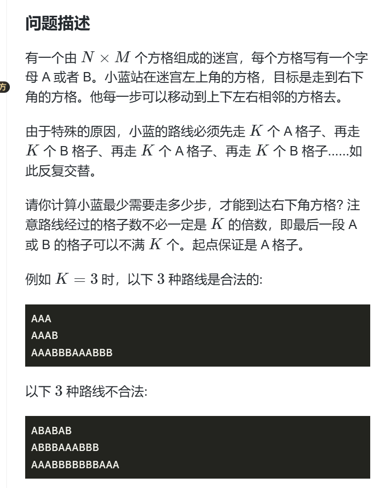
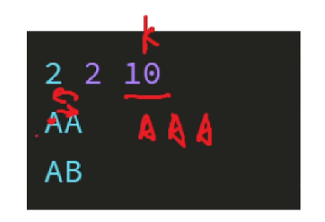

# 题目描述


# 难点：
- 怎么找最短路？
- 怎么保证相同的字母最多只走k次？
- 如果例子如下：
 怎么得到答案？
即可以循环走的遍历图怎么保证不死循环，达到一定的次数自动跳出循环？

# 解决办法
- 怎么找最短路： 当我们步长是1的时候，bfs就是最短路。 其次我们应该用一个dis数组，保存从起点开始到当前点最短步数是多少。 有时候可以存经过的点数为多少，灵活转换，这道题就是存储经过的点数。
- 怎么保证相同的字母最多走K次？
我们根据dis数组中存储的当前是经历的第几个点，然后根据这个值我们可以del/k 看看是k的第几个倍数。 del/k %2 当为0，则走A，偶数倍；反之则走B；

- 怎么保证相同的字母最多走K次？
  分层图算法：在记录有咩有走过的图多加一维；在此基础上这一维代表走到这里算当前k倍数中的第几个数。即可保证。

# 代码：
```
#include<bits/stdc++.h>
#define INF 0x3f3f3f3f

using namespace std;

int n,m,k;
const int N = 1010;
int g[N][N];
bool st[N][N][20];
int dis[N][N][20];

int dx[4] = {-1,0,1,0};
int dy[4] = {0,1,0,-1};

bool check(int x,int y){
	if(x >= 0 &&x <= n-1&&y>= 0&& y<= m-1)
		return 1;
	return 0;
} 


int bfs(){
	for(int i = 0; i < n;i++){
		for(int j = 0 ; j < m; j++){
			for(int z = 0; z < k;z++){
				dis[i][j][z] = INF;
			}
		}
	}	
	
	queue<array<int,3> >q;
	dis[0][0][1] = 1;
	st[0][0][1] = 1;
	q.push({0,0,1});
	
	while(q.size()){
		auto t = q.front();
		q.pop();
		int x = t[0],y = t[1],cnt = t[2];
		int d = dis[x][y][cnt];
		for(int i =0; i < 4; i++){
			int nx = x+dx[i];
			int ny = y+dy[i];
			int nc = (d/k)%2;
			if(check(nx,ny) &&g[nx][ny] == nc&& !st[nx][ny][(d+1)%k]){
				st[nx][ny][(d+1)%k] = 1;
				q.push({nx,ny,(d+1)%k});
				dis[nx][ny][(d+1)%k] = d+1;
			}
		}
	}
	
	int MIN = INF;
	for(int i = 0; i <  k; i ++){
		MIN = min(MIN,dis[n-1][m-1][i]);
	}
	
	return MIN; 
		
}
 
int main(){
	cin >> n >> m >> k;
	for(int i = 0; i < n ; i++){
		for(int j = 0; j <m; j++){
			char t;
			cin >>t;
			g[i][j] = (t != 'A');
		}
	}
	
	int ret = bfs();
	if (ret == INF)
		cout << -1 << endl;
	else 
		cout << ret -1<< endl;
		 
}
```

# 启示
分层图这个算法为什么会想到用？ 做题者一定不要被测试案列所蒙蔽，一定要思考一下有什么难以解决，特别的例子。