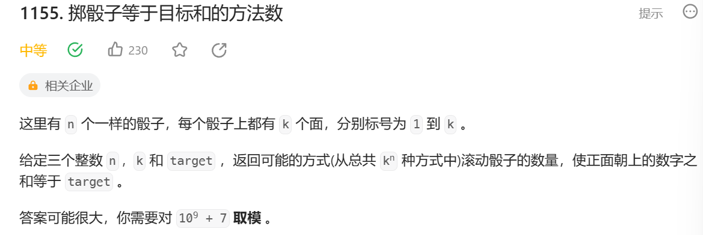
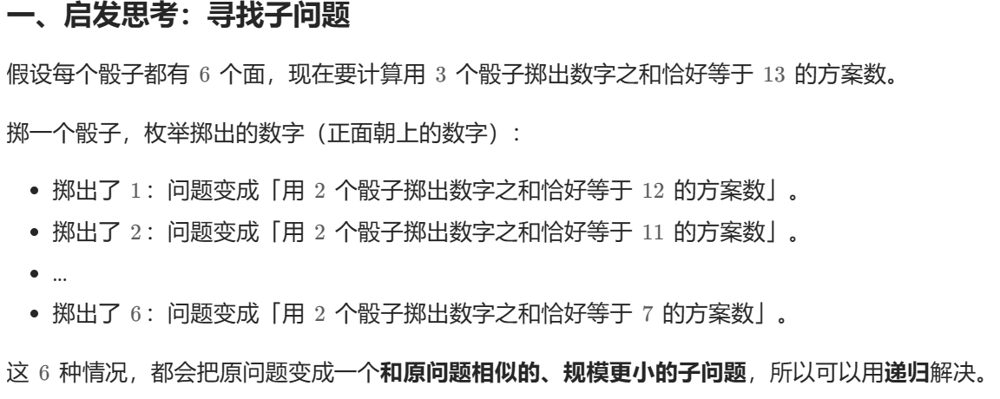
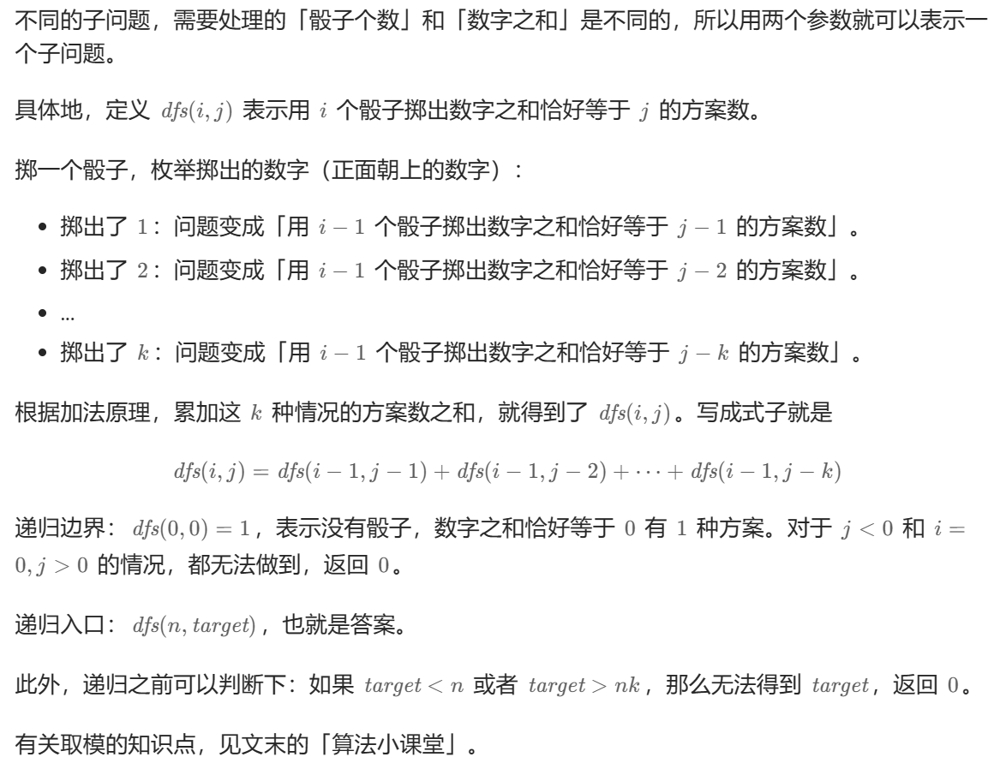
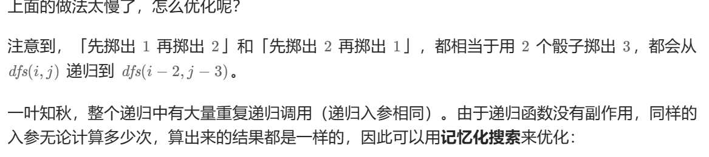

首先我们明确，DP有两种方式;选或不选 ， 选哪一个。  这个题目属于选哪一个的类型。

首先DP的三大要素：定义子问题，定义边界，定义转移方程。

选哪个？ 




定义边界：
如果需要凑成的数是负数，return 0；或者遍历到此截止。
当筛子为0的时候，需要凑成的数也要为0 return1； 否则，return 0；

但是写递归也是超时，我们该怎么办？
我们发现：


于是，我们可以使用记忆化搜索来实现快速解题。

具体操作是定义一个二维数组，来存储值。初始值为-1，如果不是初始值，说明已经计算过了，我们直接return就行了。

```
class Solution {
public:
    int numRollsToTarget(int n, int k, int target) {
        if (target < n || target > n * k) {
            return 0; // 无法组成 target
        }
        const int MOD = 1'000'000'007;
        vector<vector<int>> memo(n + 1, vector<int>(target - n + 1, -1)); // -1 表示没有计算过
        function<int(int, int)> dfs = [&](int i, int j) -> int {
            if (i == 0) {
                return j == 0;
            }
            int &res = memo[i][j]; // 注意这里是引用
            if (res != -1) { // 之前计算过
                return res;
            }
            res = 0;
            for (int x = 0; x < k && x <= j; x++) { // 掷出了 x
                res = (res + dfs(i - 1, j - x)) % MOD;
            }
            return res;
        };
        return dfs(n, target - n);
    }
};
```
