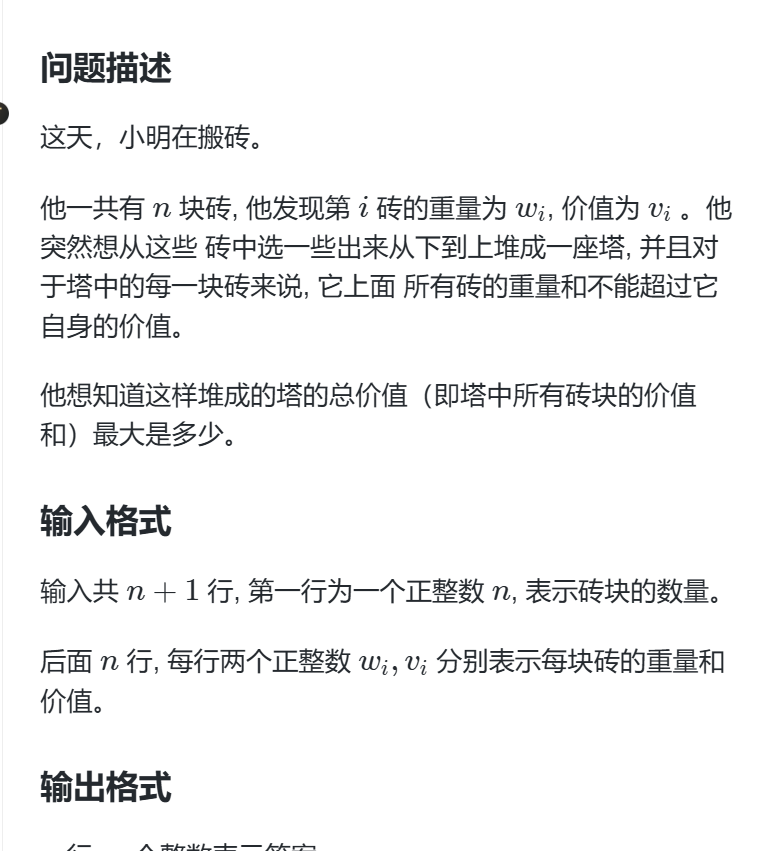

# 题目


# 难点
1. 怎么想到用01背包
2. 怎么保证满足这个叠加条件？
   
# 解决
1. 典型的01背包题呀，数据给出的两个属性，选出来最大值。一眼就该想到01背包。
2. 但是有这个叠加的条件，我们不能直接选择。 我们需要用贪心按照w+v从小到大排序。
```
cmp(int a,int b){
    return a < b  这是升序
    
    return a > b  这是降序
}
```
为什么这么贪心？ 核心在于 必须最大化每一块砖的利用率 即最小化v-W总的值。

怎么保证上面的所有总重量不大于本砖的V呢？ 我们需要再01dp下手，我们的塔的总重量范围控制在 自身的重量加自身的价值。 因为在上面砖最大就是本身砖的价值。这样就能保证满足条件。

上代码，注意这个01背包代码是一维的，即遍历的时候必须从大到小遍历哈

# 代码
```
#include<bits/stdc++.h>
using namespace std;

const int N = 1e3+10;
int n;

struct stone{
    int w,v;
}s[N];

long long f[20 * N]; // 表示当前重量下的最大价值
bool st[N];
int W[N],V[N];
long long ans;


bool cmp(stone A,stone B){
    return A.v+A.w < B.v+B.w;
}

int main(){

    cin >> n;
    for(int i = 0; i < n; i++){
        cin >> s[i].w >> s[i].v;
    }

    sort(s,s+n,cmp);
	
	for(int i =0; i< n;i++){
		for(int j = s[i].v+s[i].w; j >= s[i].w;j--){
			f[j] = max(f[j],f[j-s[i].w]+s[i].v);
			ans = max(f[j],ans);
		}
	}
	cout << ans <<"\n";
    return 0;
}
```