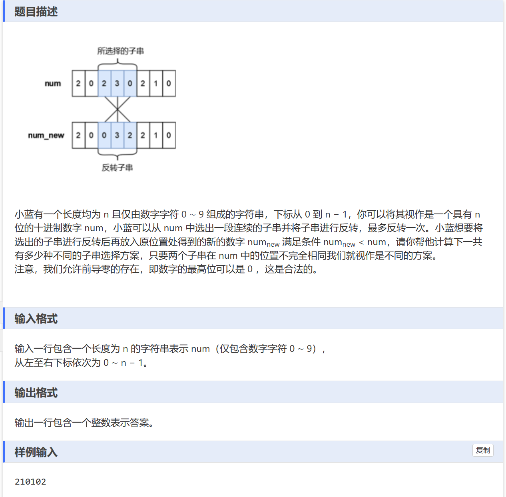

# 题目


自己的暴力解法：
```
#include<bits/stdc++.h>
using namespace std;
const int N = 5e3+10;
long long a[N];
int main(){
	string s;
	cin >> s;
	
	if(s.size() == 1){
		cout<<0<<"\n";
		return 0;
	} 
	
	for(int i = 0; i < s.size(); i++){
		a[i] = s[i];
	}
	
	long long ans = 0;
		
	for(int i = 0; i < s.size();i++){
		for(int j = i+1;j <s.size();j++){
			if(a[i] > a[j]){
				ans++;
			}else if(a[i] == a[j]){
				
				if(j - i +1 <4)
					continue;
				int left = i,right = j;
				
				for(;left < right;left++,right--){
					if(a[right] < a[left]){
						ans++;
						break; 
					}else if(a[right] > a[left])
						break;
				}
			}
		}
	}
	
	cout<<ans<<"\n";
} 
```

但是自己还是卡主了，主要还是因为粗心，if落下了一个条件，蓝桥杯就是考验缜密程度。所以我们写的时候一定要思考全面，写完检查一遍if条件。


# 区间DP  小区间状态推出大区间的状态
区间DP通常适用于这几类问题:

求解序列/字符串中区间的最值问题
比如给定一个序列,求序列中任意区间的最大/最小和、最长/最短子序列等。这类问题可以用区间DP来解决,通过合理的状态转移方程,利用较小区间的最值信息来推导出较大区间的最值。

统计满足特定条件的区间个数
就像你提到的那个反转字符串的问题,需要统计反转后小于原串的子串个数。这类问题可以用区间DP来按区间长度递推,对每个区间判断是否满足条件并更新计数。

确定最优区间组合
有些问题需要从序列中选择一些区间,使得这些区间没有重叠,且总的价值/权重最大或最小。这种问题可以用区间DP来解决,通过枚举每个区间的起点和终点,并合理地利用之前计算过的结果来确定是否选择当前区间。

字符串问题中的回文判断
判断一个字符串是否可以通过操作(删除、插入等)得到回文串,这类问题往往可以使用区间DP,通过检查反向对称区间的性质来推导出更大区间的性质。

切割问题
对于一些切割问题,比如切割钢条、切割矩阵等,可以将问题看作是在序列中选取区间,通过区间DP来记录以不同位置切割时的最优解。

总的来说,区间DP适用于这样一类问题:需要在序列中选取一些区间,使这些区间满足某种条件(最值、无重叠等),或者进行特定的操作(反转、删除等),求解最优解或统计方案数量。关键是利用状态转移的思路,通过较小区间的解来推导出较大区间的解。


---
这个问题看起来是一个字符串反转的问题,最初可能并不会直接联想到使用区间DP来解决。但是仔细思考后,我们可以发现这个问题具有一些可以使用区间DP的特点:

有一个序列(字符串),需要在序列中选择一个子序列(子串)进行操作(反转)。
操作后的结果(新字符串)需要满足一定条件(小于原字符串)。
问题要求的是不同的选择方案的数量。
这种涉及在序列中选择子序列,进行操作,求解方案数量的问题,通常可以使用区间DP来解决。

区间DP适用于这样一类问题:对于一个序列(数组、字符串等),我们需要在序列中选择一个或多个区间,进行某种操作或满足某种条件,最终求解一个最优解或方案数量等。

区间DP的基本思路是:

定义 dp[i][j] 表示在序列的 i 到 j 这个区间内的某种状态或值。
找到状态转移方程,利用较小的区间 dp[i][k] 和 dp[k+1][j] 来推导出较大区间 dp[i][j] 的值。
设计合理的计算顺序,通常是根据区间长度从小到大进行计算。
总的来说,区间DP适用于需要在序列中选择区间,进行操作或满足条件,求解最优解或方案数量等这一类问题。它利用状态转移的思路,将序列分割为更小的区间,通过较小区间的值来推导出较大区间的值,最终得到序列的整体解

```
#include<bits/stdc++.h>
#define endl '\n'
#define deb(x) cout << #x << " = " << x << '\n';
#define INF 0x3f3f3f3f
using namespace std;
const int N = 5e3 + 10;
int f[N][N];

void solve()
{
	string s;cin >> s;
	int ans = 0;
	for(int len = 2; len <= s.size(); len ++) //模板：外层是区间长度，内层是左右端点。
	{
		for(int l = 0; l + len - 1 < s.size(); l ++)
		{
			int r = l + len - 1;
			
			if(s[l] > s[r])
				f[l][r] = 1;
			else if(s[l] == s[r])
				f[l][r] = f[l + 1][r - 1]; 
			
			ans += f[l][r];
		}
	}
	cout << ans << endl;
}
signed main()
{
	ios::sync_with_stdio(0);
	cin.tie(0);
	cout.tie(0);
	int t;
	t = 1;
	//cin >> t;
	while(t--)
	solve();
}

```
