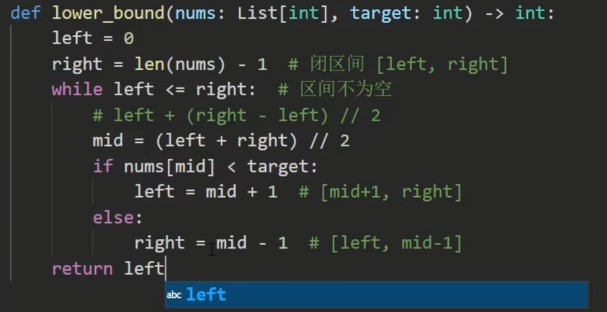

## 什么时候用二分：
看到「最大化最小值」或者「最小化最大值」就要想到**二分答案**，这是一个固定的套路。

## 写法：
### 闭区间：
更新：
L  = M+1;
R = M-1;
这样的话：
我们可以确定循环不变量：L-1及以后绝对是红色的，R+1绝对是蓝色的。
根据循环不变量可得答案
闭区间有两个含义：第一个就是上面的。 第二个我认为是取值范围，区间内都可选。
根据题意选择是返回r+1或者l-1；

### 左开右闭区间：
left初始值要往左一个。
right初始值不变。
left不再是mid+1，而是mid；
判断条件是l < r;
用来选取满足条件的最大值。

