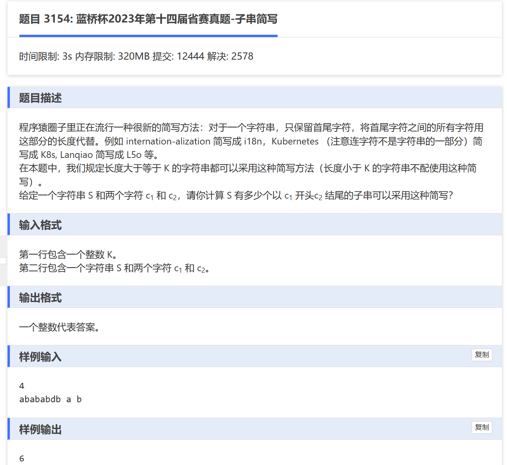

# 二分思路
我们需要一个数组存储所有C1 字符的下标。

因为我们选取有一个判断公式
```
p2 - p1 + 1 >= k

所以

p1 <=  p2 + 1 - k

// p2 C2字符下标   P1 c1字符下标
```

我们根据这个公式使用二分找到正确的 p2 + 1 -K这个值。


```
#include<bits/stdc++.h>
#define INF 0x3f3f3f3f
#include<string.h>
using namespace std;

vector<int> c1;
int main(){
	ios::sync_with_stdio(false);
	cin.tie(0);
	cout.tie(0);
	
	string data;
	int k,num =  0;
	char head,tail;
	
	cin >> k;
	cin >> data >> head >> tail;
	
	for(int i = 0; i < data.length();i++){
		if(data[i] == head)
			c1.push_back(i);
			
		if(data[i] == tail){
			if( !c1.size() || i - c1[0] + 1 < k )
				continue;
			
			
				
				int l = 0,r = c1.size() - 1;
				
				while(l < r){
					int mid = l + r + 1 >> 1;
					if(c1[mid] <= (i-k+1))
						l = mid;
					else
						r = mid - 1;
				}
				
				if(i - c1[l] + 1 >= k)
					num += (l + 1);
			
		}
	}
	
	cout << num <<"\n";
}
```


# 思考
## 为什么能用二分

我觉得重点在于，根据条件我只要找到第一个满足条件的临界值的下标就能解决问题。 然后，二分天生就是来解决寻找临界值的问题的。