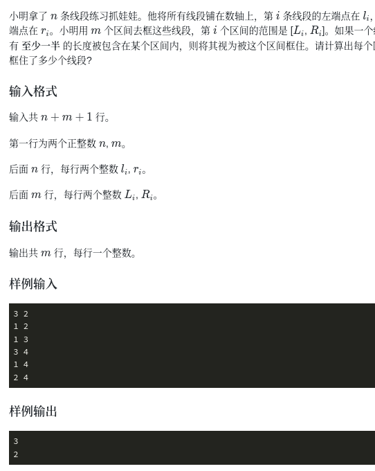
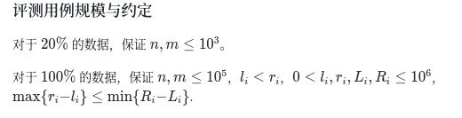

# 题目描述


重点： 

这个性质告诉我们，脑筋值转弯，当线段中点在区间范围内就一定这个区间包含这个线段的一半以上。
举范例，如若不满足这个条件，那么只有一种情况：线段大于区间范围，但是这是不可能的。


## 如何使用二分
那我们首先把中点记录下来，其次我们该怎么判断一个区间里包含多少个中点呢？ 一个个便历绝对不够。 那么可以用二分，首先就是找到第一个大于等于区间左端点的下表，其次找到第一个小于等于区间右端点的下标。既可以算出


## 代码

```
#include <bits/stdc++.h>
#define x first
#define y second
using namespace std;
int main()
{
  int n,m;
  cin >> n >>m;
  vector<pair<int,int>> p(m);
  vector<double> middot(n);
  
  

  for(int i = 0 ; i <n ; i++){
    double x,y;
    cin >> x >>y;
    middot[i] = (x+y)/2.0;
  }
  
  for(int i = 0 ; i <m; i++){
    cin >> p[i].x >> p[i].y;
  }
  
  sort(middot.begin(),middot.end());
  
  for(int i = 0 ;i < m;i ++){
      
      int left  = 0, right = n-1;
      while(left <= right){
          int mid = left + right  >> 1;
          if(middot[mid] < p[i].x) // 因为我们想找到第一个大于等于目标值的下标，那么当mid下标的值等于这个目标的时候，我们不确定它是不是第一个，所以right还有往左走。所有等于号给right。
              left = mid +1;
          else
              right = mid -1; 
      }

    int left1 = 0, right1 = n-1;
    while(left1 <= right1){
        int mid = left1 + right1 + 1 >> 1;
        if(middot[mid] <= p[i].y)//因为我们想找到第一个小于等于目标值的下标，那么当mid下标的值等于这个目标的时候，我们不确定它是不是第一个小于等于的，所以left还有往右走。所以等于号给left。
            left1 = mid +1;
        else 
            right1 = mid -1;
    }
    
    if(middot[left] >= p[i].x && middot[right1] <= p[i].y)
        cout<< right1-left +1 <<endl;
    else
        cout << 0 << endl; 
  }

  return 0;
}
```