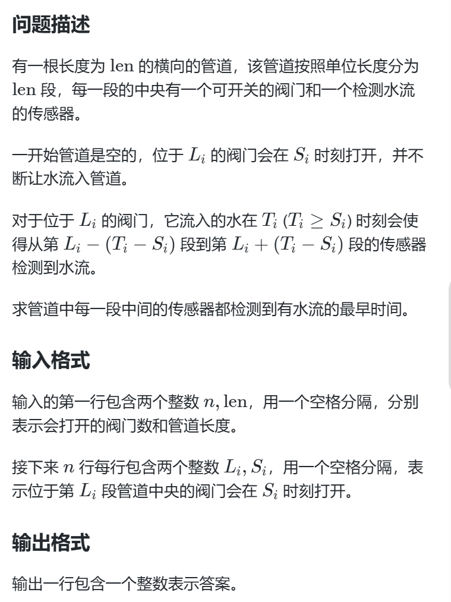

# 题目描述


# 难点
1. 某一时刻都防水，那么对于每一个阀门都有自己的区间，由于是单调递增有明显的两端性，可以用二分，那么判断条件是什么呢？

# 解决办法
我们知道每一个阀门都有区间，那么区间之间避免不了重复的一段，判断管道满没满我们可以合并区间的办法

我们首先记录非0的区间，按照区间左端点升序排序，然后用last变量记录上一段合并区间的右端点。
判断左端点是否大于last，如若大于说明线段之间有空隙，不能构成一个整体 即管道没满。
小于就更新last为两线段的最大值。  根据最后合成的线段的端点判断管道满没满

重点就是这个合并区间的思想。

# 代码
```
#include<bits/stdc++.h>
using namespace std;

long long n,len;
const int N = 1e5+10;

struct  valve{
	long long l,s;
}a[N];

struct SEG{
	long long l,r;
}seg[N];

bool cmp(struct SEG seg1,struct SEG seg2){
	if(seg1.l != seg2.l)
		return seg1.l < seg2.l;
	else
		return seg1.r < seg2.r;
}

bool check(int mid){  // 合并区间
	long long cnt = 0;
	for(long long i = 0; i < n; i++){
		if(mid < a[i].s) continue;
		seg[cnt].l = a[i].l-(mid - a[i].s);
		seg[cnt].r = a[i].l+(mid - a[i].s);
		cnt++;
	}
	sort(seg,seg+cnt,cmp);
	
	long long last = 0;
	for(long long i =0 ; i < cnt; i++){
		if(seg[i].l > last+1 )	// 这里last+1 是特例。
			return false;
		last = max(seg[i].r,last);
	}
	if(last < len)
		return false;
	return true;
}
int main(){
	cin >> n >>len;
	for(long long i = 0; i < n; i++){
		cin >> a[i].l >> a[i].s;
	}	
	
	long long left = 0,right = 2e9;
	while(left <= right){
		long long mid = left+(right-left)/2;
		if(check(mid))
			right = mid -1;
		else
			left = mid +1;
	}
	
	cout<< left <<"\n";
} 
```