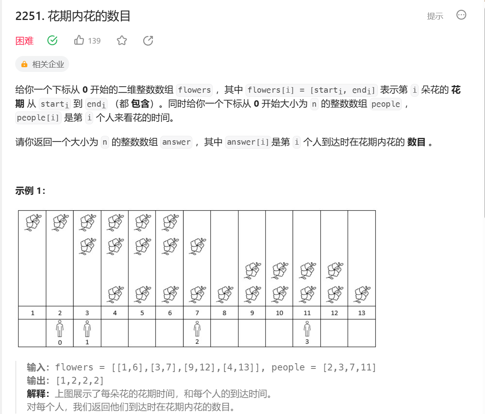
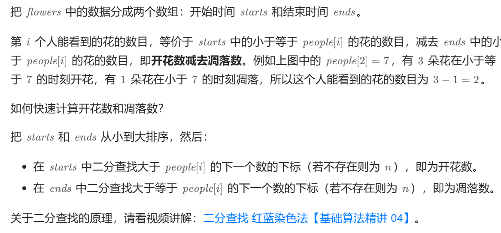

解题思路：


通过二分查找＋排序 快速得到范围内的数目，从而快速得到题解。

```
class Solution {
public:
    vector<int> fullBloomFlowers(vector<vector<int>>& flowers, vector<int>& people) {
        int n = flowers.size();
        vector<int> starts(n),ends(n);
        for(int i = 0; i < n;i++)
        {
            starts[i] = flowers[i][0];
            ends[i] = flowers[i][1];
        }
        sort(starts.begin(),starts.end());
        sort(ends.begin(),ends.end());
        for(int &p : people)
        {
            p = (upper_bound(starts.begin() , starts.end(),p) - starts.begin()) - (lower_bound(ends.begin(),ends.end() ,p) - ends.begin());
        }
        return people;
    }
};
```

- upper_bound(starts.begin(), starts.end(), p) - starts.begin()
：**upper_bound()**函数返回一个迭代器，指向在范围**[starts.begin(), starts.end()]**中第一个大于**p**的元素[1](https://www.geeksforgeeks.org/upper_bound-in-cpp/)。如果没有找到这样的元素，它将返回**starts.end()**[1](https://www.geeksforgeeks.org/upper_bound-in-cpp/)。然后，通过减去**starts.begin()**，我们可以得到这个元素在向量**starts**中的索引位置[1](https://www.geeksforgeeks.org/upper_bound-in-cpp/)。
- lower_bound(ends.begin(), ends.end(), p) - ends.begin()
：**lower_bound()**函数返回一个迭代器，指向在范围**[ends.begin(), ends.end()]**中第一个不小于**p**的元素[2](https://www.geeksforgeeks.org/lower_bound-in-cpp/)。如果所有的元素都小于**p**，它将返回**ends.end()**[2](https://www.geeksforgeeks.org/lower_bound-in-cpp/)。然后，通过减去**ends.begin()**，我们可以得到这个元素在向量**ends**中的索引位置[2](https://www.geeksforgeeks.org/lower_bound-in-cpp/)。


你需要减去**starts.begin()**来得到索引位置。这是因为**upper_bound()**和**lower_bound()**函数返回的是一个迭代器，而不是一个索引。迭代器是一个指向容器中元素的指针。
当你从**starts.begin()**或**ends.begin()**减去这个迭代器时，你实际上是在计算两个迭代器之间的距离，这就给出了元素在向量中的索引位置。
例如，如果**upper_bound(starts.begin(), starts.end(), p)**返回的迭代器指向**starts**的第5个元素，那么**upper_bound(starts.begin(), starts.end(), p) - starts.begin()**将会得到4（因为索引是从0开始的）