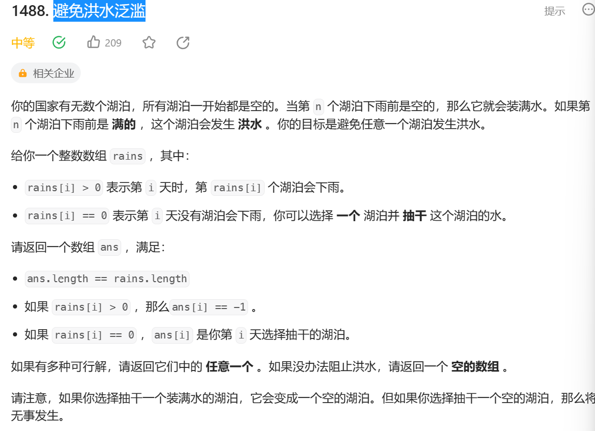

题目重点就是避免泛滥，当即将泛滥之前我们要把它抽干。

我们一遍for循环，把晴天的数字放在set有序集合里面。当遇到某个池塘要满的时候，我们在set中二分查找，找到大于池塘第一次下雨的晴天抽干它。

```
class Solution {
public:
    vector<int> avoidFlood(vector<int>& rains) {
        vector<int> ans(rains.size(), 1);
        set<int> st;
        unordered_map<int, int> mp;
        for (int i = 0; i < rains.size(); ++i) {
            if (rains[i] == 0) {
                st.insert(i);
            } else {
                ans[i] = -1;
                if (mp.count(rains[i])) {
                    auto it = st.lower_bound(mp[rains[i]]);
                    if (it == st.end()) {
                        return {};
                    }
                    ans[*it] = rains[i];
                    st.erase(it);
                }
                mp[rains[i]] = i;
            }
        }
        return ans;
    }
};
```
我们也可以使用unordered _map实现哈希集合。