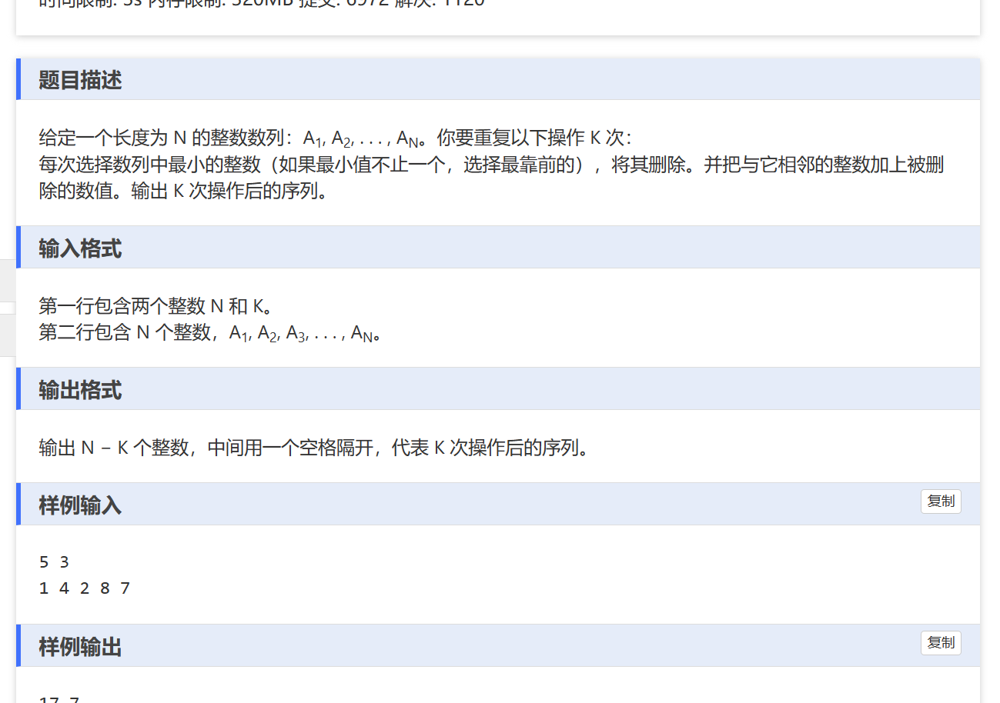
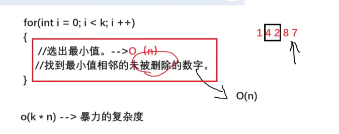

具体解题思路：
    

我们使用链表和优先队列（堆）来实现这个红色区域的优化。

```
#include<bits/stdc++.h>
using namespace std;
typedef pair<int,int> pii;

const int N = 5e5 + 10;
int n,m;
int a[N],l[N],r[N],st[N];

int main(){
	ios::sync_with_stdio(false);
	cout.tie(0);
	cin.tie(0);
	
	priority_queue<pii, vector<pii>, greater<pii>>q;
	
	cin >> n >>m;
	for(int i = 0; i <n; i++){
		cin >>a[i];
		q.push({a[i],i});
		
		l[i] = i - 1; // 模拟链表， 存储当前节点的左节点 
		r[i] = i + 1; // 存储右节点。 
		
		if(i == n -1)
			r[i] = -1;					
	}
	
	while(m){
		auto t = q.top();
		q.pop();
		
		if(t.first != a[t.second]){
			q.push({a[t.second],t.second});
			continue;
		}
		m--;
		if(l[t.second] >= 0)
			a[l[t.second]] += t.first;
		
		if(r[t.second] >= 0)
			a[r[t.second]] += t.first;
			
		if(l[t.second] >= 0)
			r[l[t.second]] = r[t.second];
		
		if(r[t.second] >= 0)
			l[r[t.second]] = l[t.second];
			
		a[t.second] = -1;
		}
	
	for(int i = 0; i < n; i++){
		if(a[i] != -1)
			cout<< a[i] << " "; 
	}
	
} 
```

优先队列可以快速找到最大值（最小值）
在这个代码中，找的是最小值，加了vector，greater参数。

学到了在堆中更新某个节点数值，我们应该如何处理。用一个数组记录节点的最新值，如果pop出来的数值不是最新值，那么直接去掉，continue；

用两个数组来记录当前节点的左右节点，模拟链表。