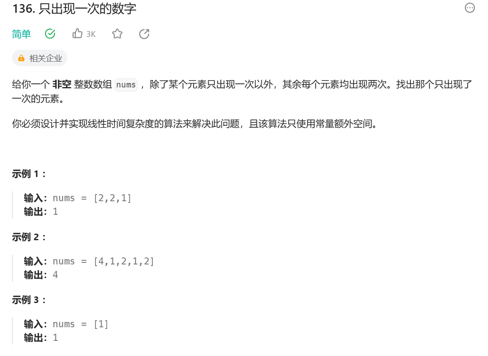

1.位运算
```
class Solution {
public:
    int singleNumber(vector<int>& nums) {
        int result = 0;
        for (int i = 0; i < nums.size(); i++) {
            result ^= nums[i];
        }
        return result;
    }
};
```
这个解决方案利用了异或操作的以下性质：
任何数和 0 做异或操作，结果仍然是原来的数，即 
a XOR 0 = a。
任何数和其自身做异或操作，结果是 0，即 
a XOR a = 0。
异或操作满足交换律和结合律，即 
a XOR b XOR a = a XOR a XOR b = 0 XOR b = b。
所以，数组中的每个元素都进行异或操作，最后剩下的就是只出现一次的元素。

运用哈希表查找，通过遍历哈希表的方式查找

```
class Solution {
public:
    int singleNumber(vector<int>& nums) {
        unordered_map<int,int>mp;
        for( int num : nums ){
            ++mp[num];
        }
      for(auto [a,b] : mp)
      {
          if(b == 1)
            return a;
      }
        return 0;
    }
};
```
