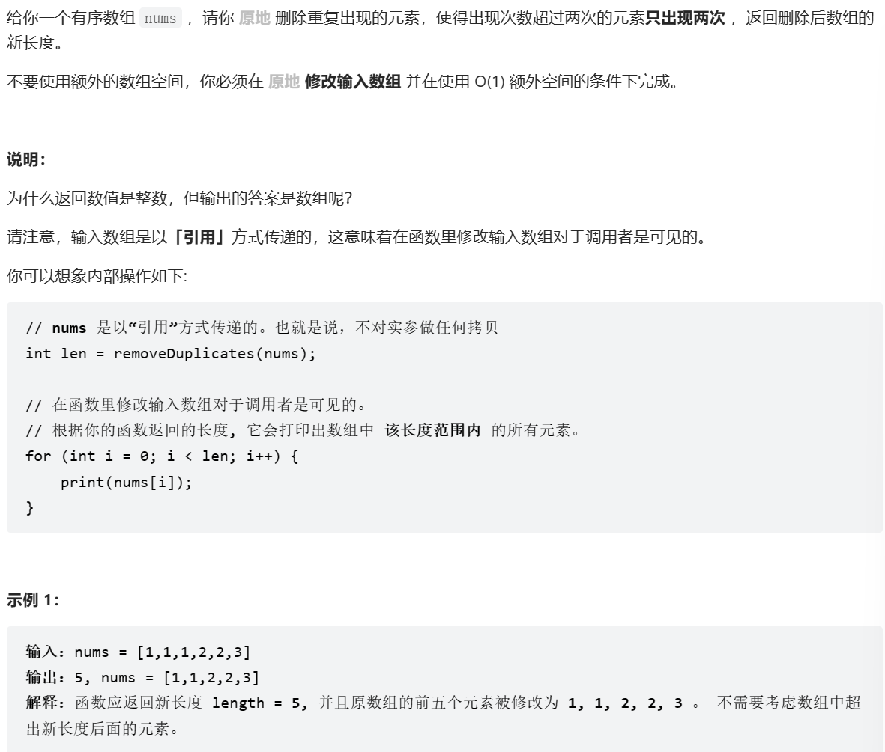

办法：
```
class Solution {
public:
    int removeDuplicates(vector<int>& nums) {
      int len = nums.size();
      if(len <= 2)
        return len;
      int l=2,r=2;
      
      while(r < len)
      {
          if(nums[l - 2] != nums[r])
          {
              nums[l] = nums[r];
              l++;
          }
          r++;
      }
      return l;
    }
};
```

 启发：
真的很吊 第一次见这样的思路。维护了最多两个数字相等。
