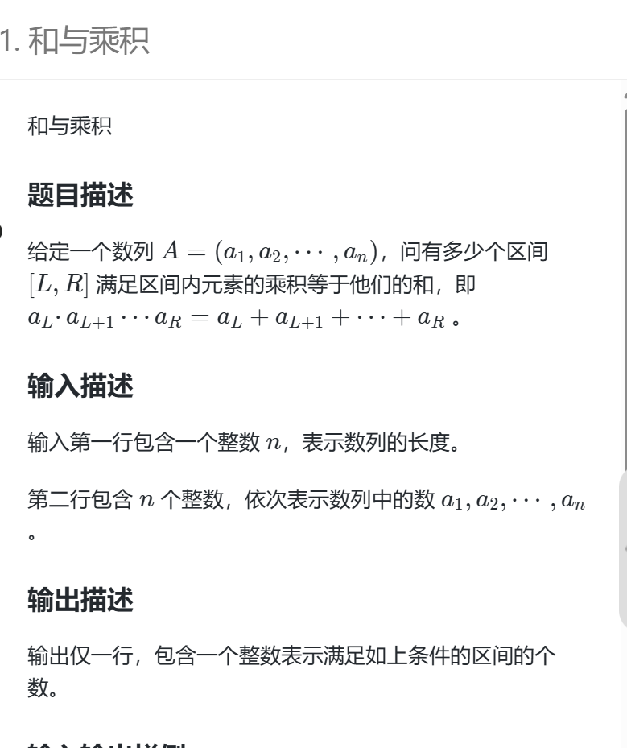

# 和与乘积


# 思维难点
1. 求区间和，我们很容易想到前缀和，但是如和求区间积呢？前缀积？
2. 如何保证在规定时间内解题？

# 解决办法
前缀积当然不行！ 因为，我数组有2e5个数字，如若相乘起来，数字大的恐怖，绝对会爆 longlong只能存储2的64次方。
那么怎么求区间积？ 我们用到思维的办法。我们研究重点就在这些非1的数乘积上。

在这些非1的数上，我们可以知道这段区间内的和为多少（前缀和），也知道这些积为多少（累乘），如若能从左右两边的1补充起来，满足和==乘积就行了。  
那么重点在非1的数字上，怎么保证选取区间的时间复杂度？

很简单，我们就用两重for循环的办法。我们通过上述知道乘积最多最多不能超过2的64次方，那么我们放宽范围，乘数不能超过64位，不然比较不了。 所以对于每一个非1的数作为左端点，最多只会遍历64个数字，时间复杂度 64*n 就是 0（n）;

再有一个重点就是，判断两边的1够不够补上积与和的差，我们就可以通过双指针的算法计算每一个数字左边（右边）的1的数量。


# 代码
```
#include<bits/stdc++.h>
using namespace std;
typedef long long ll;

const int N = 2e5+10;
ll a[N],b[N],id[N],r[N],l[N];
int n;

ll sum[N];

int main(){
	cin >>n;
	ll ans = 0;
	ll count = 0;
	for(int i = 1; i <= n; i++ ){
		cin >>a[i];
		sum[i] = sum[i-1]+a[i];
		
		if(a[i] != 1){ 
			count++; 
			b[count] = a[i];
			id[count] = i;
		}else{
			ans++;
		} 
	}
	
	for(int left = 1,right =2; left <= n; left++){
		while(right <= n && a[right] == 1)
			right++;
		
		r[left] = right - (left + 1);
		
		if(right == left+1){
			right++;
		}
	}
	
	for(int left = n-1,right =n; right >= 0; right--){
		while(left >= 0 && a[left] == 1)
			left--;
		
		l[right] = right - (left + 1);
		
		if(left == right-1){
			left--;
		}
	}
	
	ll maxv = sum[n];
	
	for(int i = 1; i <= count;i++){
		ll c = 1;
		for(int j = i; j <= count;j++){
			c *= b[j];
			if(c > maxv) break;
			ll dis = c - (sum[id[j]] - sum[id[i]-1]);
			if(dis == 0)
				ans++;
			else if(dis > 0 && r[id[j]] + l[id[i]] >= dis){
				ll x = min(dis,l[id[i]]);
				ll y = min(dis,r[id[j]]);
				ans+=(x+y -dis +1);
			}
		}
	}
	cout <<ans<<"\n";
	return 0;
} 
```

# 总结
纯纯思维题，很考验思维。 必须要意识到内存限制，给的数据一定会有很多1，不然无法解题。因为数组给了2e5个，单单是最小的2 相乘起来都是一个十分恐怖的数字。