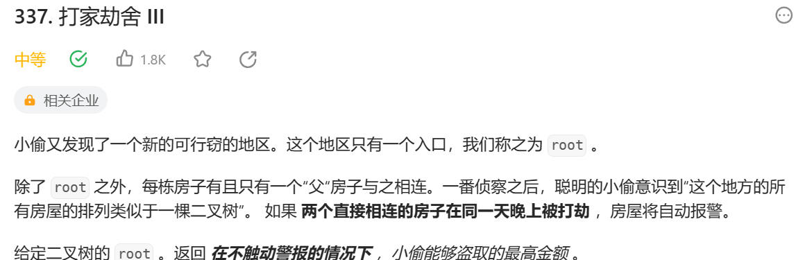

dp的思想很简单，只是不熟悉c++中的哈希该如何使用。
原始代码：
```
/**
 * Definition for a binary tree node.
 * struct TreeNode {
 *     int val;
 *     TreeNode *left;
 *     TreeNode *right;
 *     TreeNode() : val(0), left(nullptr), right(nullptr) {}
 *     TreeNode(int x) : val(x), left(nullptr), right(nullptr) {}
 *     TreeNode(int x, TreeNode *left, TreeNode *right) : val(x), left(left), right(right) {}
 * };
 */
class Solution {
public:
    int rob(TreeNode* root) {
        if(root == NULL)
            return 0;
        //找到root->left,root->right,root->left->right,root->left->left;root->right,root->right->left,root->right->right;
        //子题： 就是还是dp思想。和前面几题很像的。
        int num1 = rob(root->left);
        int num2 = rob(root->right);
        int num3=0,num4= 0,num5 = 0,num6 = 0;
        if(root->left != NULL)
        {
             num3 = rob(root->left->right);
             num4 = rob(root->left->left);
        }
       if( root->right != NULL)
        {
             num5 = rob(root->right->left);
             num6 = rob(root->right->right);
        }
       
        if(num5+num6+num3+num4+root->val > num1+num2 )
            return num5+num6+num3+num4+root->val;
        else
            return num1+num2;
    }
};
```
超时了，因为我们算爷爷能偷多少时，算了儿子和孙子的，当儿子成为爷爷后，又要算一遍孙子的，这就重复了。
所以我们用哈希表记录，就避免了重复运算，提高了效率。
```
class Solution {
public:
    int rob(TreeNode* root) {
        std::unordered_map<TreeNode*, int> memo;
        return robInternal(root, memo);
    }
private:
    int robInternal(TreeNode* root, std::unordered_map<TreeNode*, int>& memo) {
        if (root == nullptr) return 0;
        
        if (memo.count(root)) return memo[root]; 用count来看看这个位置是否为空。
        
        int money = root->val;
        
        if (root->left) {
            money += (robInternal(root->left->left, memo) + robInternal(root->left->right, memo));
        }
        if (root->right) {
            money += (robInternal(root->right->left, memo) + robInternal(root->right->right, memo));
        }
        
        int result = std::max(money, robInternal(root->left, memo) + robInternal(root->right, memo));
        
        memo[root] = result;
        return result;
    }
};
```
关于这个代码有个细节：
int robInternal(TreeNode* root, std::unordered_map<TreeNode*, int>& memo) 
这行这个代码要求输入一个哈希表引入，因为呀，和变量一样，你要改变变量值就要输入变量引入（指针），所以这里也是一个道理。我们要改变哈希表内部的值
