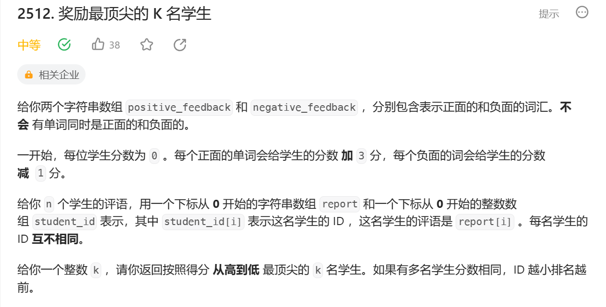

一个单词对应一个分，为了快速查找这个字符和获得这个字符的分数。我们要用哈希表。避免了一次次for循环。

stringstream ss。
```
class Solution {
public:
    vector<int> topStudents(vector<string>& positive_feedback, vector<string>& negative_feedback, vector<string>& report, vector<int>& student_id, int k) {
        unordered_map<string,int> words;
        for(const auto& word : positive_feedback)
        {
            words[word] = 3;
        }
        for(const auto& word : negative_feedback)
        {
            words[word] = -1;
        }
        vector<vector<int>>A;
        for(int i = 0; i< report.size();i++)
        {
            stringstream ss;相当于一个容器 它会根据空格分隔string
            string w;
            int score = 0;
            ss << report[i];放入容器。
            while(ss >> w)从ss中拿出单词 直到为空
            {
                if(words.count(w))
                    score+=words[w];
            }
            A.push_back({-score,student_id[i]});
        }
        sort(A.begin(),A.end());
        vector<int>top;
        for(int i = 0; i< k; i++)
        {
            top.push_back(A[i][1]);
        }
        return top;
    }
};
```
