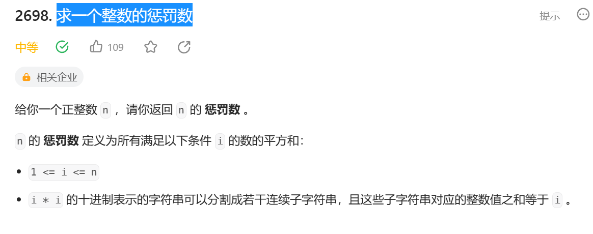

这个问题我们可以dfs，回溯来做。从pos开始已经有tot数，想达到target数。
用dfs来进行。

```
class Solution {
public:
    bool dfs(string s, int pos, int tot, int target)
    {
        if(pos == s.size())
            return tot == target;
        int sum = 0;
        for(int i = pos; i < s.size();i++)
        {
            sum = sum*10 + s[i]-'0';
            if( sum > target)
                break;
            
            if(dfs(s,i+1,sum+tot,target))
                return true;
        }
        return false;
    }
    int punishmentNumber(int n) {
        int res = 0;
        for(int i = 1; i <= n ;i++)
        {
            string s = to_string(i*i);
            if(dfs(s,0,0,i))
                res+= i*i;
    
        }
        return res;
    }
};
```
