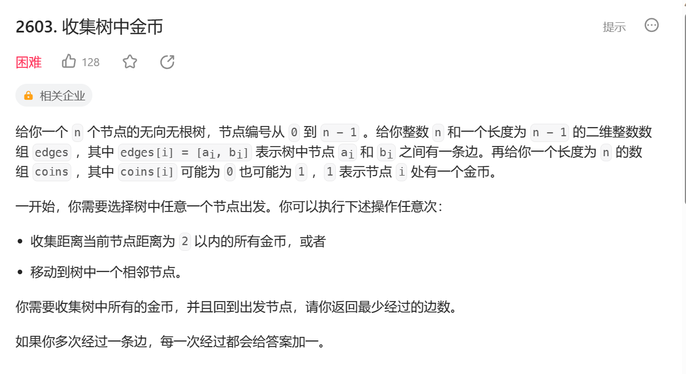
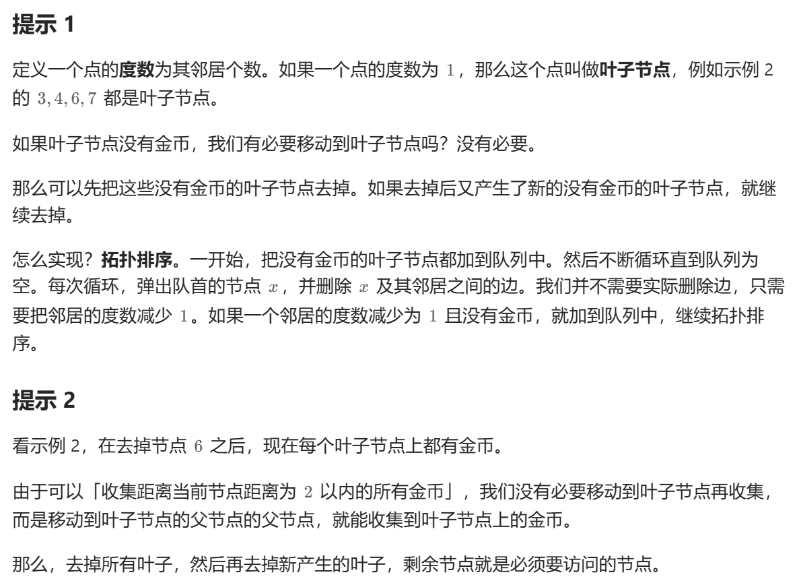
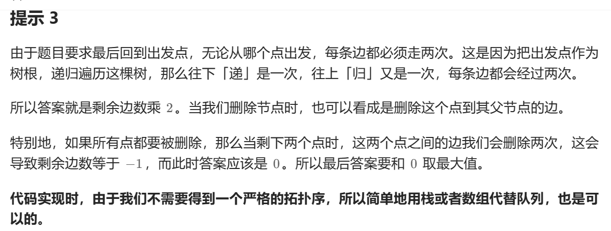
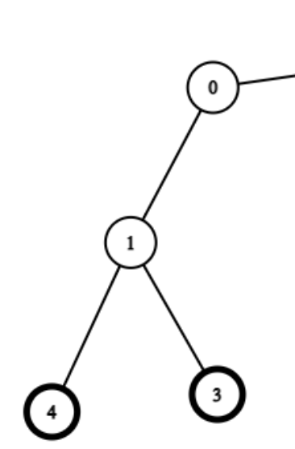

重点：




难点1： 为什么要去除叶无用子节点？
因为：无用叶子节点，它完全是多余的，我们不会用到它，从它开始也绝对不会是最优解，因为它在末尾。我们几乎不会用到它，就把它消除，简化图。

难点2：
因为是只有n-1条边，它几乎就是直线样式。
为什么要保证有金币的父节点是叶子节点再减去边？ 
就是为了防止这种情况。


难点3：
为什么要和零取大值？
如果全都是没有金币的呢？所有点要删掉，那么得到的left—edges是负1，最小应该是0.

拓扑排序的概念：
拓扑排序的过程通常如下：
1. 从 DAG 图中选择一个没有前驱（即入度为0）的顶点并输出。
1. 从图中删除该顶点和所有以它为起点的有向边。
1. 重复步骤1和2，直到当前的 DAG 图为空或当前图中不存在无前驱的顶点为止。后一种情况说明有向图中必然存在环。
```
class Solution {
public:
    int collectTheCoins(vector<int>& coins, vector<vector<int>>& edges) {
       int n = coins.size();
        vector<vector<int>> g(n);
        vector<int> deg(n);
        for(auto &e: edges)
        {
            int x = e[0],y = e[1];
            g[x].push_back(y);
            g[y].push_back(x);
            deg[x]++;
            deg[y]++;
            
        }
        int left_edges = n -1;
        vector<int> q;
        for(int i = 0; i <n; i++)
        {
            if(deg[i]==1 && coins[i] == 0)
                q.push_back(i);
        }
        while(!q.empty())
        {
            left_edges--;
            int x = q.back();
            q.pop_back();
            for(int y :g[x])
                if(--deg[y] == 1&&coins[y] == 0)
                    q.push_back(y);
        }
        for(int i = 0; i< n;i++)
            if(deg[i] == 1 && coins[i])
                q.push_back(i);
        
        left_edges -= q.size();
        for(int x:q)
            for(int y:g[x])
                if(--deg[y] == 1)
                    left_edges--;
        
        return max(left_edges*2,0);
    }
};
```
