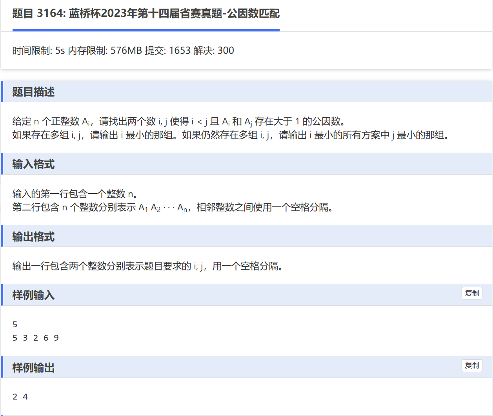

# 思路
由数学定理，我们可知：一个数可以分解为若干个质数的乘积（质因数）。因为质数是大于1的，那么如果两个数字由相同的质因数，那么他们就有大于1的公因数。


## 分解质因数算法
```
void prim(int x, int pos) {
	for(int i = 2; i <= x / i; i ++){ // i^2 <= x
		if(x % i)
			continue;
		st[i].push_back(pos);
		while(x % i == 0){
			x /= i;
		}
	}

	if(x > 1){
		st[x].push_back(pos);
	}
	return;
}
```
记住就行吧。

```
#include<bits/stdc++.h>
using namespace std;

map<long long,vector<long long> > st;
#define INF 0x3f3f3f3f


void prim(long long x,long long pos){
	for(long long i = 2; i <= x/i;i++){
		if(x % i)
			continue;
		st[i].push_back(pos);
		while(x%i == 0){
			x /= i;
		}
	}
	
	if(x > 1)
		st[x].push_back(pos);
	return;
} 

int main(){
	ios::sync_with_stdio(false);
	cin.tie(0);
	cout.tie(0);
	
	long long n;
	cin >> n ;
	 
	for(long long i = 1; i <= n; i++){
		int x;
		cin >> x;
		prim(x,i);
	}

	pair<long long ,long long> ans = {INF,INF};
	
	for(auto [x,y] : st){
		if(y.size() < 2)
			continue;
		
		if(y[0] < ans.first)
			ans = {y[0],y[1]};
		else if(y[0] == ans.first){
			if(y[1] < ans.second)
				ans = {y[0],y[1]};
		}
	}
	cout << ans.first <<" "<< ans.second <<"\n"; 
	return 0;
}
```