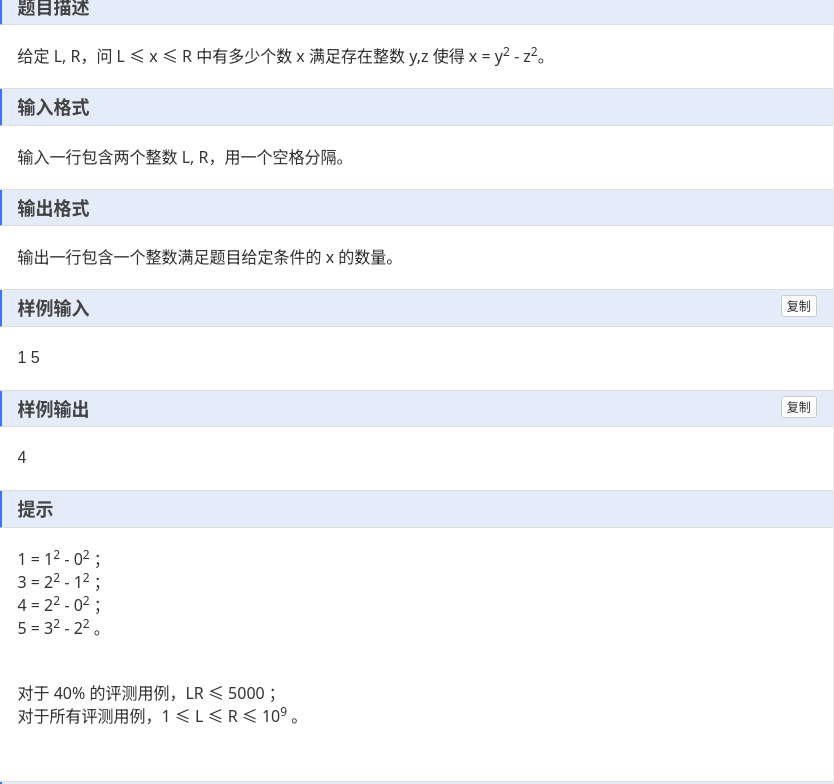

由题目知道,这个很数值太大了,o(n)算法都很难过,所以这是暗示我们找规律的一道题.


我们可以打表(举例子)的方式来找到规律.
我们举例一百之内的答案,我们就可以找到规律. 即找到所有奇数和所有4的倍数.

```
#include<bits/stdc++.h>
#define endl '\n'
#define deb(x) cout << #x << " = " << x << '\n';
#define INF 0x3f3f3f3f
using namespace std;

//打表找规律
void test(){
	map<int,int>st;
	for(int i = 1; i <= 100; i ++){
		for(int j = 0; j <= 100; j ++){
			for(int k = 0; k <= 100; k ++){
				if(i == (j * j - k * k)){
					if(i % 2)continue;
					if(!st[i])
						cout << i << endl;
					st[i] = true;
				}
			}
		}
	}
}

void solve()
{
	// test();
	int l, r;
	cin >> l >> r;
	int sr = (r + 1) / 2 + r / 4;
	int sl = (l - 1 + 1) / 2 + (l - 1) / 4;
	cout << sr - sl << endl;
}

signed main()
{
	ios::sync_with_stdio(0);
	cin.tie(0);
	cout.tie(0);
	int t;
	t = 1;
	// cin >> t;
	while(t--)
	solve();
}

```

利用了前缀和的思想,奇数我们就向上取整,偶数就向下取整.