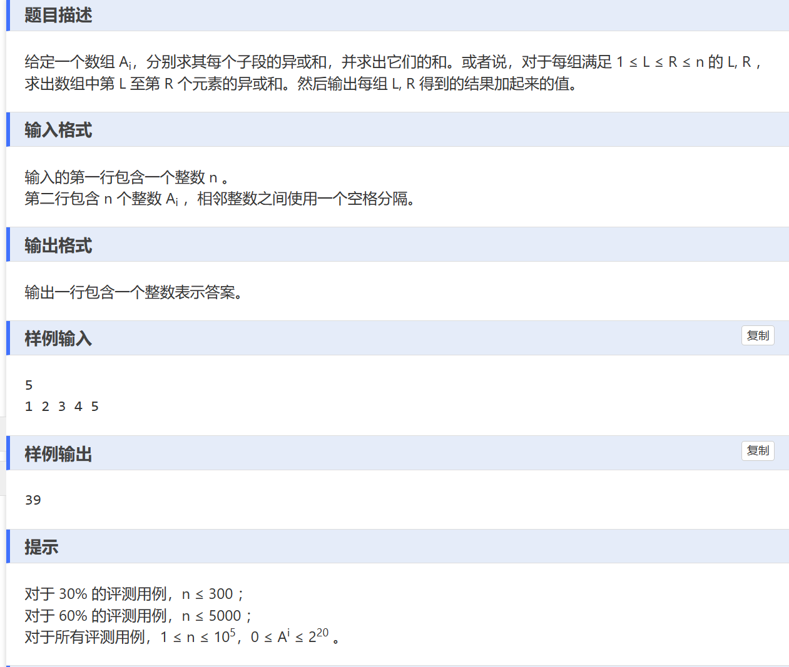

# 异或常用的结论
A^A = 0
A^0 = A
A^B = C
B^C = A
A^C = B
异或有分配律
## 前缀异或和
sum[i] = sum[i-1]^a[i]

sum[i,j] = s[j] ^ s[i - 1]

# 题目描述


位运算常用的方法： 拆位法，即把数字拆成二进制位。
常用的思想： 贡献法。

## 贡献法如何理解？
首先，一个二进制 100010001 可以理解为 100000000 + 000010000 + 000000001
因此对于每一位有贡献的数字，我们可以直接把这一位（000...1..000 2^i）加到答案里. 这样遍历所有有贡献的值，和区间范围，就可以找到ans。 此时复杂度为o（n）；

想当于对于当前这个数字，我们找到合理的区间范围，我们就加上它2^i * count.  100000000 + 000010000 + 000000001 这是横着加，我们贡献法就是竖着加。

因为是异或操作，那么我们当区间范围内1的数量为奇数时，有贡献。 区间范围1的数量为偶数时，没有贡献。 0 没有贡献。

视角从每一个区间，到了每一个进制位。

```
#include<bits/stdc++.h>
using namespace std;
const int N = 1e5+10;
long long a[N];

int main(){
	ios::sync_with_stdio(false);
	cin.tie(0);
	cout.tie(0);

	int n;
	cin >> n;

	for(int i = 0; i < n; i++){
		cin >> a[i];
	}
	long long ans = 0;
	for(int i  = 20; i >= 0; i--){
		
		long long  n1 = 0,n0=1,s=0;
		for(int j = 0; j < n;j++){
			int bit = (a[j]>>i) & 1;
			s += bit;

			if(s %2){
				ans+=(1 << i) * n0;
				n1++;
			}
			else{
				ans += (1<<i) * n1;
				n0++;
			}
			
		}

	}

	cout << ans <<"\n";
	return 0;
}
```

