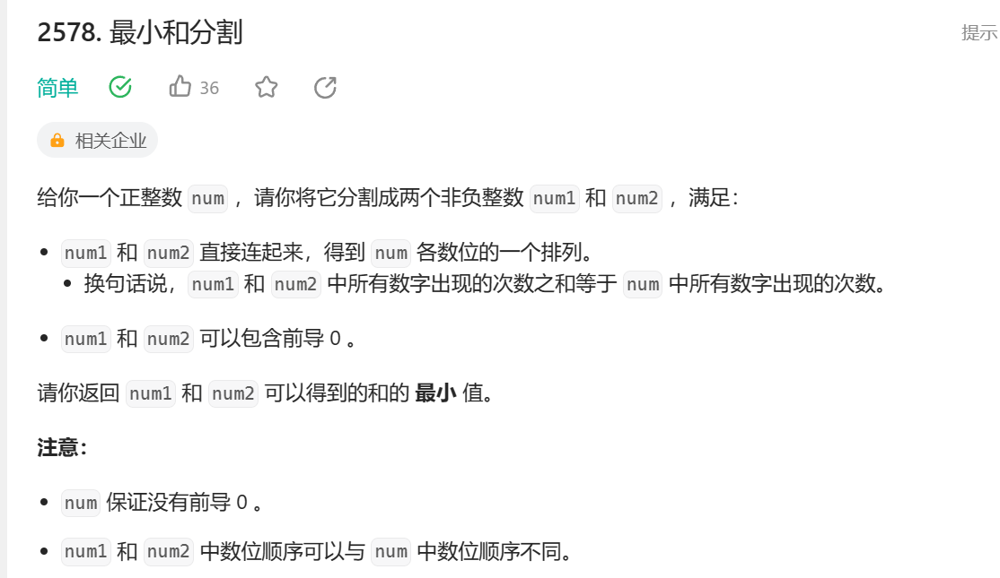

题目并不难，代码优化空间很大。
这是我的代码：
```
class Solution {
public:
    vector<int> ans;
    int splitNum(int num) {
        int time = 0;
        int num1= 0,num2 = 0;
        while(num)
        {
            ans.push_back(num%10);
            num /= 10;
            time++;
        }
        sort(ans.begin(),ans.end());
        
            for (int i = 0; i < ans.size(); ++i) {
            if (i % 2 == 0) {
                num1 = num1 * 10 + ans[i];
            }
            else {
                num2 = num2 * 10 + ans[i];
            }
            }
        return num1 + num2;
    }
};
```
这是优化代码：
```
class Solution {
public:
    int splitNum(int num) {
        string stnum = to_string(num);
        sort(stnum.begin(), stnum.end());
        int num1 = 0, num2 = 0;
        for (int i = 0; i < stnum.size(); ++i) {
            if (i % 2 == 0) {
                num1 = num1 * 10 + (stnum[i] - '0');
            }
            else {
                num2 = num2 * 10 + (stnum[i] - '0');
            }
        }
        return num1 + num2;
    }
};
```
我们可以直接把数字转化为字符串，这样不需要vector去存储了，也不需要重新while去填充了，实在是妙。