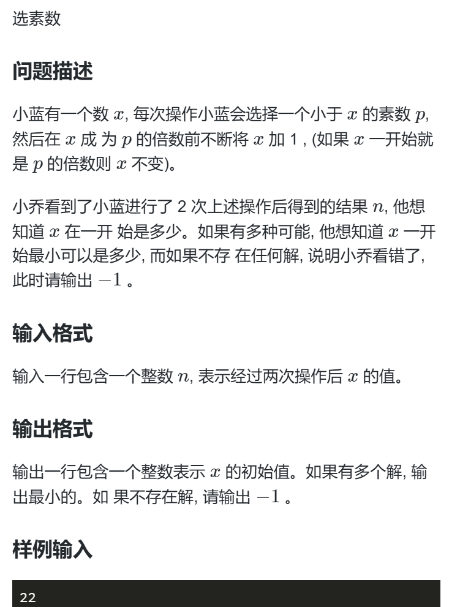

# 题目


# 难点
难在如何找到答案的数学思维
难在找到最大质因数


# 解决
设进一次循环后得到的数为m。
一次变换很容易得到 不等式：   m - P1 < x <=  m ;P1是小于X的质数，同时也是m的质因数
那么 x >= m -P1 +1  X最小 即 m最小，P1最大  即需要求m的最大质因数

那么同理可得求m的最小数可通过n求
n>= m（min） >= n-P2+1

如何找出不合法的？ 因为题目要求经过两次变换，得到的值，必是某数的倍数，绝不可能是质数。那么如果最大质因数是自身，则它就是质数。是质数说明不合法 输出-1

```
#include<bits/stdc++.h>
using namespace std;

int Getmaxprim(int n){
	int  res =0;
	for(int i = 2; i <= sqrt(n); i++){
		if (n % i == 0){
			while(n % i == 0) n /= i;
			res = max(i,res);
		}
	}
	
	if(n > 1)
	res = max(n,res);
	return res;
}

int ans = 1e6+10;

int main(){
	long long n;
	cin >> n;
	
	int p2 = Getmaxprim(n);
	if(p2 == n){ // 不合法条件
		cout << -1 <<"\n";
		return 0; 
	}
	
	for(int i = n-p2+1;i <= n;i++){
		int p1 = Getmaxprim(i);
		if(p1 != i){ // m也不能是质数，它经过一次变换。
			ans = min(ans,i-p1+1);
		}
	}
	
	cout << ans <<"\n";
	return 0;	
} 
```