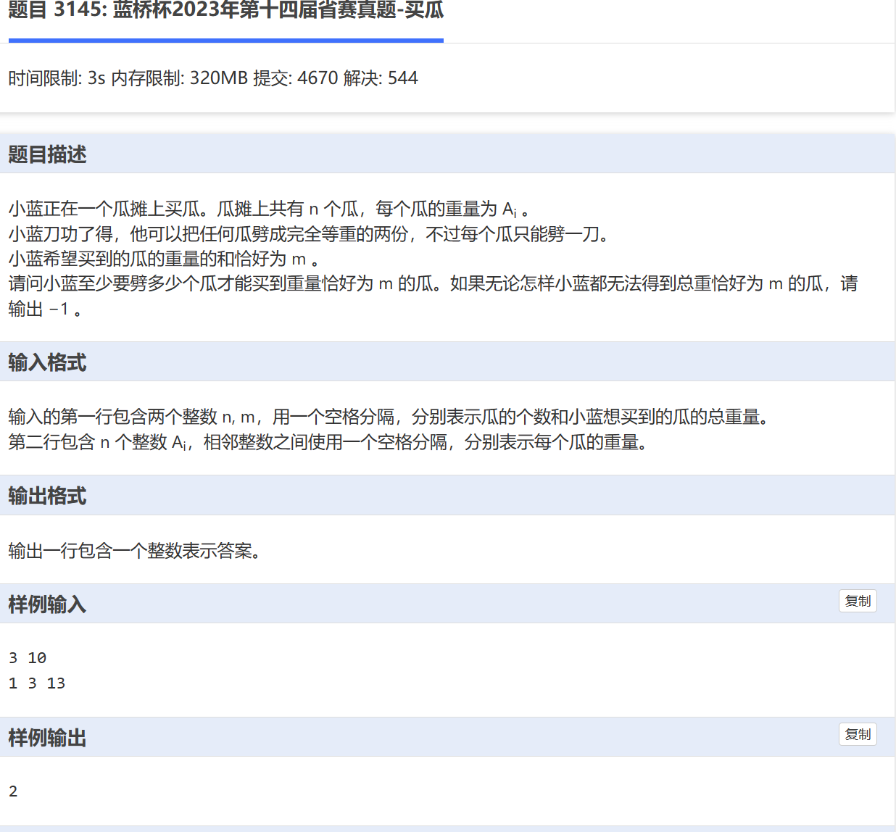

# 思路
首先数据量不大，最大五十个瓜，可以暴力。
每个瓜有三个状态：全要，要一半，不要。用dfs暴力

##  需要剪枝
重点！！

剪枝可以减少暴力所话的时间。
在我们的这道题中，我看可以当这种解题方案的ans不如我们保存的ans，直接终止这条方案的探索。当剩下的所有瓜加在一起都没有目标大，停止探索。我们可以使用后缀和。

##  代码
```
#include<bits/stdc++.h>

using namespace std;

double data[40];
double s[40];
#define INF 0x3f3f3f3f
int n,m,ans =INF;

void  dfs(int num ,int cnt, double total){
	if( total == m)
	{
		ans = min(cnt,ans);
		return; 
	}
	
	if(total >m || cnt >= ans || num >= n || total +s[num] < m)
		return ;
	

	dfs(num+1,cnt,total + data[num]);
	
	dfs(num+1,cnt+1,total+data[num]/2);
		
	dfs(num+1,cnt,total);
	
	return ;
} 

int cmp(int x, int y)
{
	return x > y;
}

int main(){
    std::ios::sync_with_stdio(false);
	cin.tie(0);
	cout.tie(0);
	
	cin >> n >> m;
	for(int i = 0; i < n ;i++){
		cin >> data[i];
	}
	
	for(int i = n -1; i>=0; i--){
		s[i] = s[i+1] + data[i];
	}
	
	sort(data,data+n,cmp);
	
	dfs(0,0,0.0);
	
	if(ans == INF) ans = -1;
	
	cout << ans;
	
		
	return 0;
}

```
**我发现，尽量不需要dfs返回bool值，因为返回bool值会导致一些错误**  