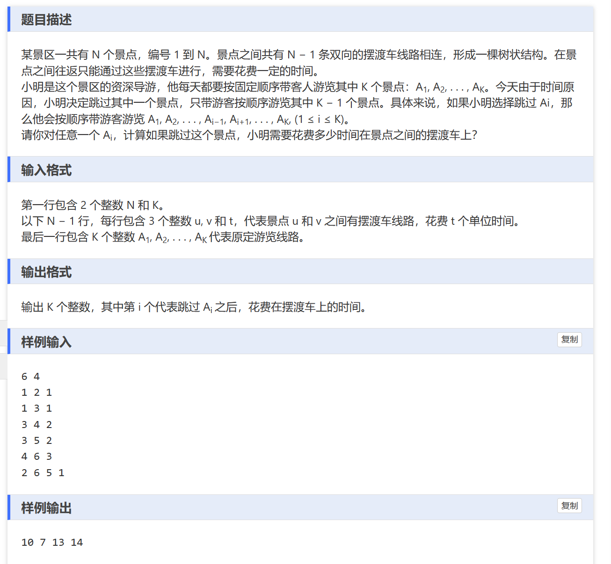

树：一个无环连通图，意味着两个点之间存在唯一一条路径。

图的存储：用vector存储当前点的邻接点。无向边的存储就是存储两条有向边。边的权值用map记录

DFS参数的信息不是一下就想到的，而是在写的过程中，发下你需要某一些信息，但是我们没有记录，此时我们可以把它作为一个参数。

```
#include<bits/stdc++.h>

using namespace std;
#define INF 0x3f3f3f3f

typedef pair<int,int> pil;
const int N = 2e5+10;
map<pil,int>st; //记录两个点之间的距离
int a[N];
int n,k; 

vector<pil>edge[N]; // 存图

bool dfs(int u,int t,int father,int v,int sum){
	if(t == v){
		st[{u,v}] = sum;
		st[{v,u}] = sum;
		return 1;
	}
	
	for(int i = 0; i < edge[t].size();i++){
		int son = edge[t][i].first;
		if(son == father)
			continue;
		int w = edge[t][i].second;
		if(dfs(u,son,t,v,sum+w))
			return 1;
	}
	return 0;
}

int main(){
	ios::sync_with_stdio(false); 
	cout.tie(0);
	cin.tie(0);
	
	cin >> n >> k;
	
	for(int i = 0; i < n -1; i++){
		int x,y,t;
		cin >> x >> y >> t;
		edge[x].push_back({y,t});
		edge[y].push_back({x,t});
	}	
	
	for(int i = 0; i <k;i++){
		cin >> a[i];
	}
	
	long long  ans = 0;
	for(int i = 0; i < k -1 ; i++){
		dfs(a[i],a[i],-1,a[i+1],0);
		ans+=st[{a[i],a[i+1]}];
	}
	
	for(int i = 0; i <k;i++)
	{
		long long temp = ans;
		if(i == 0)
			temp -= st[{a[i],a[i+1]}];
		else if(i == k -1)
			temp -= st[{a[i-1],a[i]}];
		else{
			temp -= st[{a[i -1],a[i]}];
			temp -= st[{a[i],a[i+1]}];
			dfs(a[i-1],a[i-1],-1,a[i+1],0);
			temp +=  st[{a[i-1],a[i+1]}];
		}
		cout<<temp<<"\n";
	}
	
} 
```
