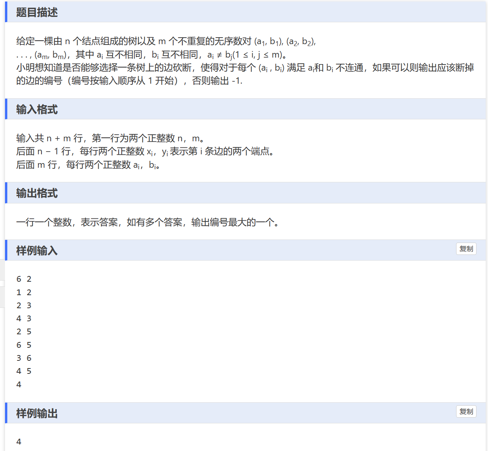

# 题目


# 思路：
    图的遍历问题，老问题，我直接暴力加暴力，对于每一掉边，我都删掉，然后每一个对都dfs一次。

```
#include<bits/stdc++.h>
using namespace std;
int n,m,ret = -1;

vector<int>edge[100020];
vector< pair<int,int> > edge_num;
pair<int,int> ans[100020];
bool dfs(int t, int v, int father) {
    if (t == v) return true;
    for (int i = 0; i < edge[t].size(); i++) {
        int neighbor = edge[t][i];
        if (neighbor != father && neighbor != 0) {
            if (dfs(neighbor, v, t))
                return true;
        }
    }
    return false;
}

int main() {
    ios::sync_with_stdio(false);
    cin.tie(0);
    cout.tie(0);

    cin >> n >> m;
    for (int i = 0; i < n - 1; i++) {
        int x, y;
        cin >> x >> y;
        edge_num.push_back({x, y});
        edge[x].push_back(y);
        edge[y].push_back(x);
    }

    for (int i = 0; i < m; i++) {
        int x, y;
        cin >> x >> y;
        ans[i] = {x, y};
    }

    vector<int> candidates;
    for (int i = 0; i < n - 1; i++) {
        int t1 = edge_num[i].first, t2 = edge_num[i].second;
        for (int j = 0; j < edge[t1].size(); j++) {
            if (edge[t1][j] == t2) {
                edge[t1][j] = 0;
            }
        }
        for (int j = 0; j < edge[t2].size(); j++) {
            if (edge[t2][j] == t1) {
                edge[t2][j] = 0;
            }
        }

        bool ok = true;
        for (int j = 0; j < m; j++) {
            if (dfs(ans[j].first, ans[j].second, -1)) {
                ok = false;
                break;
            }
        }

        if (ok) {
            ret = i + 1;
        }

        for (int j = 0; j < edge[t1].size(); j++) {
            if (edge[t1][j] == 0) {
                edge[t1][j] = t2;
            }
        }
        for (int j = 0; j < edge[t2].size(); j++) {
            if (edge[t2][j] == 0) {
                edge[t2][j] = t1;
            }
        }
    }

//    if (candidates.empty()) {
//        cout << -1 << "\n";
//    } else {
//        sort(candidates.begin(), candidates.end());
//        cout << candidates.back() + 1 << "\n";
//    }
	 
	cout<<ret<<"\n"; 
    return 0;
}
```

这很笨。

但是，如果我对于每一个对，都只跑一次，记录下来它经过的边呢？如果边被记录m次。 那么他就是公共边，需要删除。

```
#include<bits/stdc++.h>
#define int long long
using namespace std;
const int N = 1e5 + 10;

typedef pair<int,int> pii;

vector<int>edge[N];

int n, m;

int w[N];//从每一个边的边权。

map<pii, int>id;//存边的编号

//s是路径的起点，v是路径的重终点，u表示你当前走到了哪个点。
bool dfs(int s, int u, int father, int v)
{
	if(u == v)
	{
		return true;
	}


	for(int i = 0; i < edge[u].size(); i ++)
	{
		int son = edge[u][i];

		if(son == father)
			continue;

		if(dfs(s, son, u, v))
		{
			int ID = id[{u, son}];
			w[ID] ++;
			return true;
		}
	}

	return false;
}

void solve()
{
	cin >> n >> m;
	for(int i = 0; i < n - 1; i ++)
	{
		int x, y; cin >> x >> y;

		edge[x].push_back(y);
		edge[y].push_back(x);
		
		id[{x, y}] = id[{y, x}] = i;
	}

	for(int i = 0; i < m; i ++)
	{
		int x, y; cin >> x >> y;
		dfs(x, x, -1, y);
	}

	int ans = -1;
	for(int i = n - 1; i >= 0; i --)
	{
		if(w[i] == m)
		{
			ans = i + 1;
			break;
		}
	}

	cout << ans << endl;
}

signed main()
{
	ios::sync_with_stdio(0);
	cin.tie(0);
	cout.tie(0);
	int t = 1;
	// cin >> t;
	while(t--)
	solve();
}


```

需要学习的点是：它对于每个边的存储：map<pii, int>id; 这比我们方便多了。