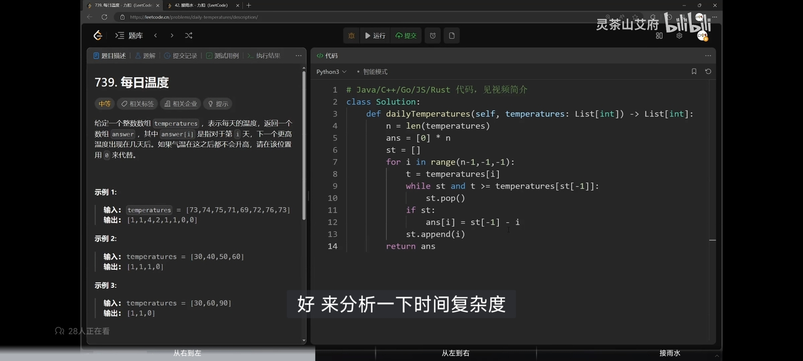
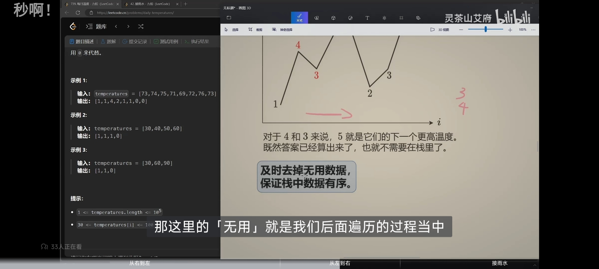

 单调栈有两种实现方式，主要解决问题是元素右边第一个大于或小于该元素的数。

  从右往左：
  从右往左向栈里压入元素。把每个数看做一座山， 例如5 2 6 都看做山的话，我们需要从左往右看，2其实是用不到的 我们只需在栈压进5 6就行。这样的单调栈从底到上是从大到小。

  从左到右
  从左到右向栈里压入元素。为了保持单调，我们要求当遍历的元素大于栈顶元素时，栈顶出栈，往复循环。以此可以实现单调栈 也是从大到小。

 我的例子都是找右边第一个大于自身的数，其余情况随机应变。 比如 小于的话 保持从小到大的单调。