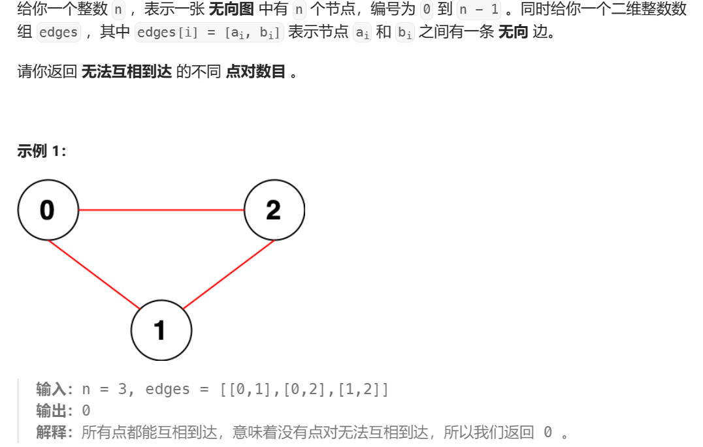

并查集的基本概念：
<font color= "#333333">并查集是一种树型的数据结构，用于处理一些不相交集合的合并及查询问题</font>
[并查集快速合并 | 菜鸟教程 (runoob.com)](https://www.runoob.com/data-structures/union-find-quick-merge.html)



<font color= "#333333">这明显就是并查集的知识点，我们可以用并查集做</font>
```
class UnionFind {
private:
    vector<int> parents;
    vector<int> sizes;
public:
    UnionFind(int n) : parents(n), sizes(n, 1) {
        iota(parents.begin(), parents.end(), 0);
    }
    int Find(int x) {
        if (parents[x] == x) {
            return x;
        }
        return parents[x] = Find(parents[x]);
    }
    void Union(int x, int y) {
        int rx = Find(x), ry = Find(y);
        if (rx != ry) {
            if (sizes[rx] > sizes[ry]) {
                parents[ry] = rx;
                sizes[rx] += sizes[ry];
            } else {
                parents[rx] = ry;
                sizes[ry] += sizes[rx];
            }
        }
    }
    int GetSize(int x) {
        return sizes[x];
    }
};
class Solution {
public:
    long long countPairs(int n, vector<vector<int>> &edges) {
        UnionFind uf(n);
        for (const auto &edge : edges) {
            uf.Union(edge[0], edge[1]);
        }
        long long res = 0;
        for (int i = 0; i < n; i++) {
            res += n - uf.GetSize(uf.Find(i));
        }
        return res / 2;
    }
};
```

dfs解题;
```
class Solution {
public:
    int dfs(int i, vector<vector<int>>& adj, vector<bool>& visit)
    {
        if(visit[i] == true)
            return 0;
        int count = 1;
        visit[i] = true;
        for(auto& a : adj[i] )
        {
            count += dfs(a,adj,visit);
        }
        return count;
    }
    long long countPairs(int n, vector<vector<int>>& edges) {
        vector<vector<int>> adj(n);
        vector<bool> visit(n+1);
        long long ans = 0;
        for(auto& e : edges)
        {
            adj[e[0]].push_back(e[1]);
            adj[e[1]].push_back(e[0]);
        }
        for(int i = 0; i < n ; i++ )
        {
            int t = dfs(i,adj,visit);
            ans += 1L* t * (n - t);
        }
        return ans/2;
    }
};
```
