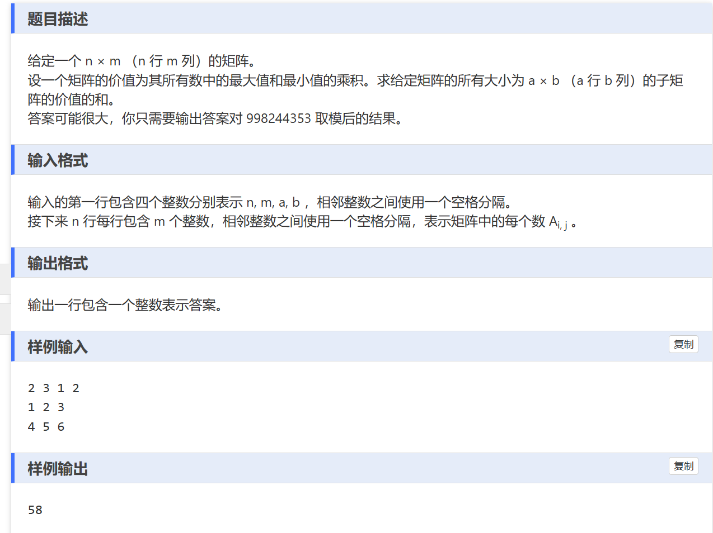

# 题目


# 滑动窗口算法简述。
## 使用背景：
- 当求数组中，子数组的最大值和最小值的时候可以用滑动窗口。

## 具体用法
用单调队列来维护当前子数组的的最大值/最小值，即队列第一个数字就是我们的所求。当输入新数字的时候，和队列前一个数字比较，如果数字比新数字小/大，那么就把旧数字删除，维护队列的单调性。

# 解题思路
我们用一维滑动窗口是来快速求解子数组的最大/最小值，但是对于矩阵我们可以看做是二维的滑动窗口。 

具体实现是对于每一行我们可以求出给定列数的数组的最小值和最大值，存储在Max_line , Min_line中，这样每一个子数组的最值就存在子数组的开头元素位置。

对于每一列，我们也可以看作是数组的求最值，用一维的解法解决。

```
#include<bits/stdc++.h>
using namespace std;

const int N = 1e3+10;

long long max_line[N][N],min_line[N][N],MAX[N][N],MIN[N][N],g[N][N],q[N];
long long ans = 0;
int main(){
	ios::sync_with_stdio(false);
	cin.tie(0);
	cout.tie(0);
	long long n,m,a,b;
	
	cin >> n >> m >> a >> b;
	for(int i = 0; i < n; i++)
	{
		for(int j = 0; j < m;j++)
		{
			cin>>g[i][j];
		}
	}
	
	for(int i = 0 ;i < n; i++){
		int h = 0, t =-1;
		for(int j = 0; j < m;j++){
			if(h <= t && j-b+1 > q[h])
				h++;
			while(h <= t && g[i][q[t]] <= g[i][j])
				t--;
			q[++t] = j;
			
			if(j-b+1 >= 0)
				max_line[i][j-b+1] = g[i][q[h]]; 
		}
	}
	
	for(int j = 0; j < m;j++){
		int h = 0,t = -1;
		for(int i = 0; i  <n ;i++){
			if(h <= t && i - a + 1 > q[h])
				h++;
			while(h <= t && max_line[q[t]][j] <= max_line[i][j])
				t--;
			q[++t] = i;
			
			if(i - a + 1 >= 0)
				MAX[i-a+1][j] = max_line[q[h]][j];
			
		}
	}
	
	
	
		
	for(int i = 0 ;i < n; i++){
		int h = 0, t =-1;
		for(int j = 0; j < m;j++){
			if(h <= t && j-b+1 > q[h])
				h++;
			while(h <= t && g[i][q[t]] >= g[i][j])
				t--;
			q[++t] = j;
			
			if(j-b+1 >= 0)
				min_line[i][j-b+1] = g[i][q[h]]; 
		}
	}
	
	for(int j = 0; j < m;j++){
		int h = 0,t = -1;
		for(int i = 0; i  <n ;i++){
			if(h <= t && i - a + 1 > q[h])
				h++;
			while(h <= t && min_line[q[t]][j] >= min_line[i][j])
				t--;
			q[++t] = i;
			
			if(i - a + 1 >= 0)
				MIN[i-a+1][j] = min_line[q[h]][j];
			
		}
	}
	
	for(int i = 0; i < n;i++)
	{
		for(int j = 0; j < m;j++)
		{
			ans =(ans+MAX[i][j]*MIN[i][j] % 998244353) % 998244353;
		}
	}
	
	cout<<ans<<"\n";
		
}
```