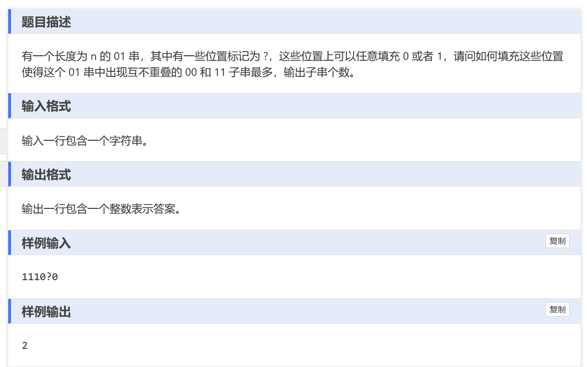

贪心题：通过最优策略找到答案。

# 解题思路
这个问题中,我们需要填充?位置,使得生成的01串中包含尽可能多的不重叠的00和11子串。为了获得最优解,我们需要遵循一些策略:

- 尽可能使用已有的0和1,而不是在?位置填充新的0或1。因为已有的0和1可以与其他位置的0和1组合形成00或11子串,而新填充的0或1则需要配对,效率较低。
对于每一个?,我们需要尽可能让它与左边的字符组合,形成00或11子串。

- 如果一个?两边都无法与之组合(即左右两边都是?或者与之不同),那么我们可以任意填充0或1。

即不要浪费已有的0，1串。

# 使用贪心的重要点：最佳子结构
对于任意一个填充方案,通过这种从左到右贪心的策略,我们一定可以获得不少于该方案的子串个数。这是因为,不管将来怎么填充右边的?,通过这种贪心策略,我们已经最大化利用了当前位置之前的所有0、1和?。换句话说,无论将来的填充如何,当前位置之前的子串数是最优的。

无论如何，我们都高效利用了？，

至于为什么能想到用这种贪心方法,关键在于:

对于每个?,我们需要尽可能利用它,不能浪费它。因此必须让它与左右两侧之一匹配,形成子串。
只要贪心地让每个?与左边匹配,就能保证不重叠性,从而更容易推导出正确性。
这两点启发了这种贪心策略。从结果来看,这种策略实现了最大化利用每个位置、避免重叠的目标,因此能获得最优解。


# 想到使用贪心的过程

1. 首先,题目要求我们填充 ? 位置,使得生成的 01 串中有尽可能多的不重叠的 00 和 11 子串。关键词是"不重叠"和"尽可能多"。对于"不重叠"这一要求,我们可以联想到贪心算法中常见的"不冲突"或"不重叠"这类约束。通常情况下,贪心算法擅长处理这种局部最优不会影响全局最优的问题。

2. 然后我开始思考如何产生最多的 00 和 11 子串。一种自然的想法是,对于每个 ?位置,我们应该尽量让它与已有的 0 或 1 匹配,从而形成更多的子串。
进一步思考,如果一个 ? 左边有 0 或 1,那肯定应该让它与左边匹配,形成 00 或 11。因为如果它与右边匹配,那在右边字符出现之前,这个 ? 是无法形成任何子串的,是一种浪费。所以对于每个 ?位置,我们应该优先让它与左边已有字符组成子串,而不关心右边字符。这恰好符合贪心算法的"局部最优"思想。

3. 再思考这种策略会不会影响到全局最优解。我意识到由于题目的"不重叠"要求,我们形成的每个子串都是独立的,不会互相影响。所以只要局部最优,那么全局就一定最优。
4. 最后,我意识到这种从左到右扫描,优先与左边匹配的策略,符合贪心算法"无后效性"和"不可逆性"的要求。每做一次选择都不会影响之前的选择,无需回溯。
综合以上分析,我基本确认可以用贪心算法来解决这个问题。只需从左到右扫描,对每个?位置,优先让它与左边已有字符组成子串,就可以获得最优解了。
总的来说,思考过程可以概括为:注意到"不重叠"和"尽可能多"的要求->联想到贪心->生成子串的贪心策略->分析局部最优不影响全局最优->分析满足无后效性和不可逆性->确定可用贪心算法求解。这个过程体现了如何从问题的特点出发,归纳总结出适合使用贪心算法的条件。


# 总结
当问题中出现“不重叠”或“不重复”这两个关键词时，贪心算法通常是一个不错的选择。这些关键词暗示了局部最优解的选择不会影响全局最优解，因此贪心策略在这种情况下可能有效。

```
#include<bits/stdc++.h>
using namespace std;
int main(){
	ios::sync_with_stdio(false);
	cin.tie(0);
	cout.tie(0);
	
	string s;
	cin >> s;
	long long  ans = 0;
	vector<bool>st(s.size());
	
	for(int i = 0; i < s.size();i++){
		if(s[i] != '?'){
			if(!st[i]){
					if(i -1 >= 0 && !st[i -1] && s[i] == s[i-1]){
					st[i] = st[i-1] = 1;
					ans++;			
				}
				else if(i+1 < s.size() && !st[i+1]&&s[i] == s[i+1]){
					
					st[i] = st[i+1] = 1;
					ans++;
				}
			
			} 
		}
		else{
			
			if(st[i])
				continue; 
			 
			if(i -1 >= 0 && !st[i -1]){
					st[i] = st[i-1] = 1;
					ans++;			
				}
				else if(i+1 < s.size() && !st[i+1]){
					
					st[i] = st[i+1] = 1;
					ans++;
				}
		}
	}
	cout <<ans <<"\n";
}
```