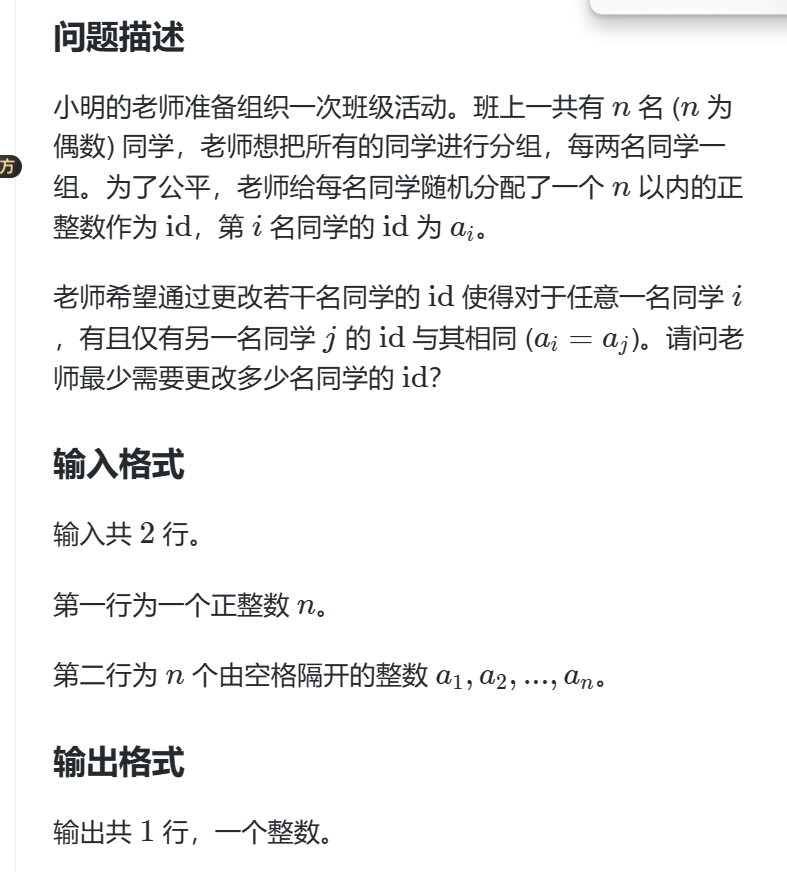

题目不难，但有警戒作用：
```
#include <iostream>
using namespace std;
const int N = 1e5+10; 
long long num[N];
long long count;
int main()
{
  int n;
  cin >> n;
  while(n--){
    int number;
    cin >> number;
    num[number] += 1;
  }

  int count2 = 0;
  for(int i = 0; i < N;i++){
    if(num[i]  == 1){
        count++;
    }
    else if(num[i] >= 2)
      count2 += num[i] - 2;
  }

  if(count >= count2)
    cout<< count2+(count - count2)/2;
  else
    cout<< count2;
  return 0;
}
```

# 坑点
我因为题目给出的测试案例，就下意识只想到了count > count2 的情况，但是还存在count2 大于 count 的情况。 我看到测试案例应该想想这个问题又没有别的想法被落下。