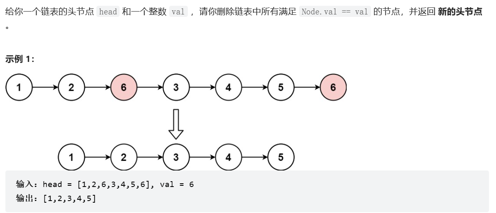
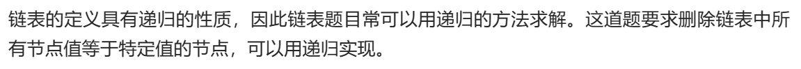
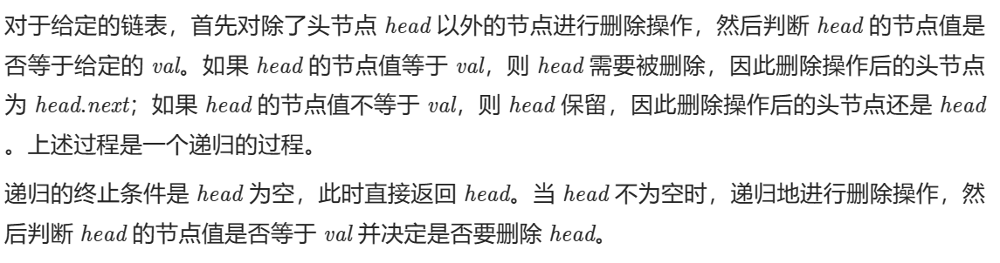

题解：






```
struct ListNode* removeElements(struct ListNode* head, int val) {
    if (head == NULL) {
        return head;
    }
    head->next = removeElements(head->next, val);
    return head->val == val ? head->next : head;
}
作者：LeetCode-Solution
链接：https://leetcode.cn/problems/remove-linked-list-elements/solution/yi-chu-lian-biao-yuan-su-by-leetcode-sol-654m/
来源：力扣（LeetCode）
著作权归作者所有。商业转载请联系作者获得授权，非商业转载请注明出处。
```

首先得到 后面的链表元素都已经把VAL 元素删除的链表，再比较头节点， 这太妙了 递归！